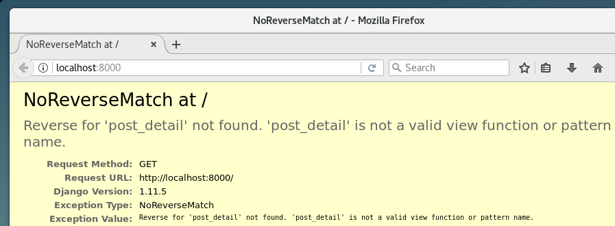
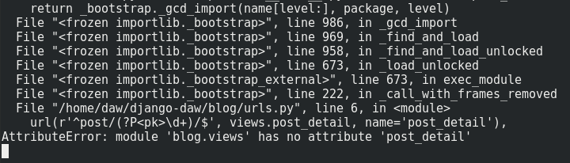
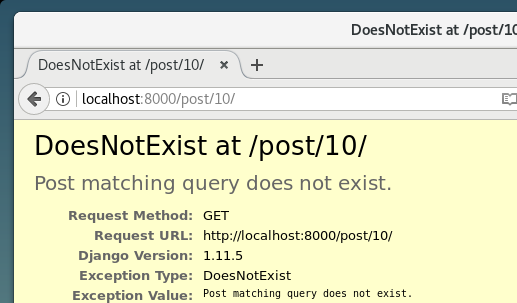
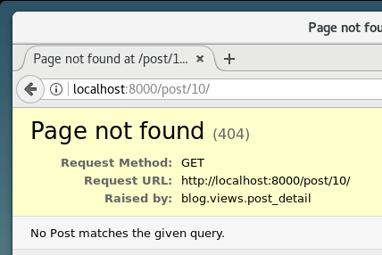
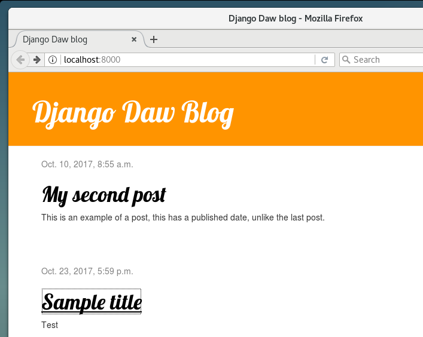
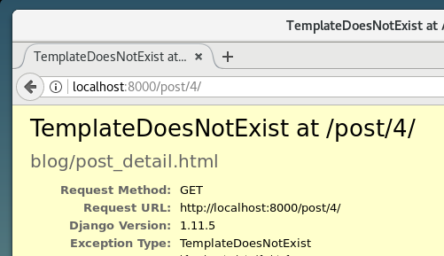
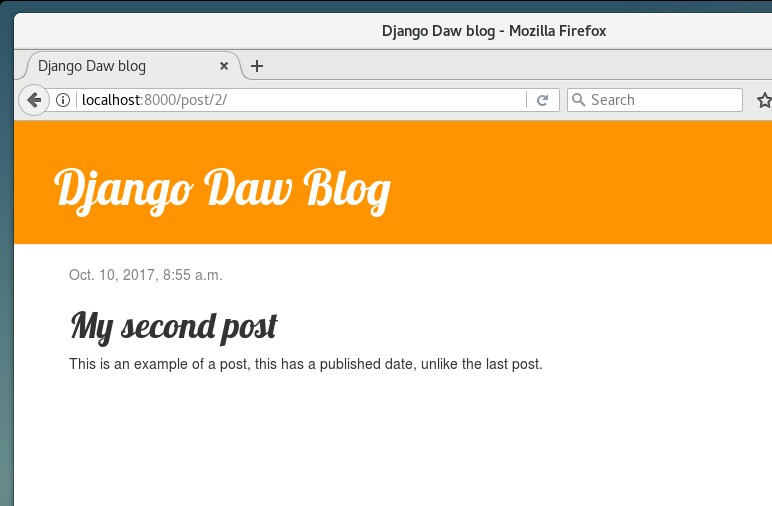

Otra cosa buena que Django tiene para tí es la **extensión de plantillas**. Esto significa que puedes usar las mismas partes de tu HTML para diferentes páginas de tu sitio web.

De esta forma no tienes que repetir el código en cada uno de los archivos cuando quieres usar una misma información o un mismo esquema. Y si quieres cambiar algo, no necesitas hacerlo en todas las plantillas.

## Crea una plantilla base

Una plantilla base es la plantilla más básica que extiendes en cada página de tu sitio web.

Vamos a crear un archivo `base.html` en `blog/templates/blog/`:

```txt
blog
└───templates
    └───blog
            base.html
            post_list.html
```

Luego ábrelo y copia todo lo que hay en `post_list.html` al archivo `base.html`, de la siguiente manera:

```html

<html>
    <head>
        <title>Django Daw blog</title>
        <link rel="stylesheet" href="//maxcdn.bootstrapcdn.com/bootstrap/3.2.0/css/bootstrap.min.css" />
        <link rel="stylesheet" href="//maxcdn.bootstrapcdn.com/bootstrap/3.2.0/css/bootstrap-theme.min.css" />
        <link rel="stylesheet" href="https://fonts.googleapis.com/css2?family=Crimson+Text:wght@600&display=swap" />
        <link rel="stylesheet" href="" />
    </head>
    <body>
        <div class="page-header">
            <h1><a href="/">Django Daw Blog</a></h1>
        </div>

        <div class="content container">
            <div class="row">
                <div class="col-md-8">
                    
                    <div class="post">
                        <div class="date">{{ post.published_date }}</div>
                        <h1><a href="">{{ post.title }}</a></h1>
                        <p>{{ post.text|linebreaksbr }}</p>
                    </div>
                    
                </div>
            </div>
        </div>
    </body>
</html>
```

Luego, en `base.html` reemplaza por completo tu `<body>` (todo lo que haya entre `<body>` and `</body>`) con esto:

```html
<body>
    <div class="page-header">
        <h1><a href="/">Django Daw Blog</a></h1>
    </div>
    <div class="content container">
        <div class="row">
            <div class="col-md-8"> </div>
        </div>
    </div>
</body>
```

Básicamente remplazamos todo entre `` con:

```html
 
```

Acabas de crear un `block`, se usa una template tag `` que te permite insertar HTML en este bloque en otras plantillas que extiendan a `base.html`. Verás como hacer esto en un momento.

Ahora guárdalo y abre tu archivo `blog/templates/blog/post_list.html` de nuevo. Elimina todo arriba de `` y debajo de ``, de forma que tu archivo se verá así:

```html

<div class="post">
    <div class="date">{{ post.published_date }}</div>
    <h1><a href="">{{ post.title }}</a></h1>
    <p>{{ post.text|linebreaksbr }}</p>
</div>

```

Y ahora agrega esta línea al inicio del archivo:

```html

```

Significa que ahora estamos extendiendo de la plantilla `base.html` en `post_list.html`. Sólo nos falta una cosa: poner todo (excepto la línea que acabamos de agregar) entre `` y ``. Como esto:

```html
  
<div class="post">
    <div class="date">{{ post.published_date }}</div>
    <h1><a href="">{{ post.title }}</a></h1>
    <p>{{ post.text|linebreaksbr }}</p>
</div>
 
```

Eso es todo. Verifica que tu sitio web aún funcione apropiadamente.

> Si tienes un error `TemplateDoesNotExists` que diga que no hay un archivo `blog/base.html` y tienes `runserver` ejecutándose en la consola, intenta pararlo (presionando Ctrl+C - las teclas Control y C juntas) y reinicialo ejecutando el comando `python manage.py runserver`.

## Amplía tu aplicación

Ya hemos completado todos los pasos necesarios para la creación de nuestro sitio web: sabemos cómo escribir un model, url, view y template. También sabemos cómo hacer que nuestro sitio web se vea mejor.

Hay qu ejercitar l aprendido. Lo primero que necesitamos en nuestro blog es, obviamente, una página para mostrar un post.

Ya tenemos un modelo `Post`, así que no necesitamos añadir nada a `models.py`.

### Crea un enlace en la plantilla

Vamos a empezar añadiendo un enlace dentro del archivo `blog/templates/blog/post_list.html`. Hasta el momento debería verse así:

```html
  
<div class="post">
    <div class="date">{{ post.published_date }}</div>
    <h1><a href="">{{ post.title }}</a></h1>
    <p>{{ post.text|linebreaksbr }}</p>
</div>
 
```

Queremos tener un enlace a una página de detalle sobre el título del post. Vamos a cambiar `<h1><a href="">{{ post.title }}</a></h1>` dentro del enlace:

```html
<h1><a href="">{{ post.title }}</a></h1>
```

Es hora de explicar el misterioso ``. Como probablemente sospeches, la notación `` significa que estamos utilizando Django template tags. Esta vez vamos a utilizar uno que va a crear una dirección URL para nosotros.

La parte `post_detail` es donde Django estará esperando una URL en `blog/urls.py` con `name=post_detail`.

Para explicar `pk=post.pk` debemos saber que `pk` es abreviatura de _primary key_ (llave primaria), que es un nombre único para cada entrada en una base de datos. Ya que no especificamos una llave primaria en nuestro modelo `Post`, Django crea una para nosotros (por defecto, es un numero que incrementa en uno para cada entrada, ej. 1, 2, 3) y lo añade como un campo llamado `pk` a cada uno de nuestros posts. Nosotros podemos acceder a la llave primaria escribiendo `post.pk`, de la misma manera que accedemos a otros campos (`title`, `author`, etc.) en nuestro objeto `Post`.

Ahora cuando vayamos a: <http://127.0.0.1:8000/> tendremos un error (como era de esperar, ya que no tenemos una dirección URL o una _view_ para `post_detail`). Se verá así:



### Creando una URL a post_detail

Vamos a crear una URL en `urls.py` para nuestro _view_ `post_detail`.

Queremos que nuestro primer post detallado sea mostrado en esta URL: <http://127.0.0.1:8000/post/1/>

Queremos crear una URL que apunte a Django a una _view_ denominada `post_detail`, que mostrará una entrada del blog. Agrega la línea `url (r'^post/(?P<pk>[0-9]+)/$', views.post_detail),` al archivo `blog/urls.py`. Debería tener este aspecto:

```python
from django.urls import path
from . import views

urlpatterns = [
    path('', views.post_list, name='post_list'),
    path('post/<int:pk>/', views.post_detail, name='post_detail'),
]
```

Esta parte `post/<int:pk>/` especifica un patron de URL — te lo explico:

-   `post/` significa que la URL debe de empezar con la palabra **post** seguido de un **/**. Hasta aquí todo bien.
-   `<int:pk>` — esta parte es un poco mas complicada. Significa que Django espera un valor de tipo entero y que lo transferirá a una vista como una variable llamada `pk`.
-   `/` — necesitamos agregar **/** de nuevo para terminar la URL.

Eso significa que si entras en `http://127.0.0.1:8000/post/5/` en tu navegador, Django entenderá que estás buscando una _view_ denominada `post_detail` y transferirá la información de `pk` que es igual a `5` a esa _view_.

Bien, hemos añadido un nuevo patron de URL a `blog/urls.py`. Actualiza la página: <http://127.0.0.1:8000/> ¡Boom! El servidor a dejado de funcionar. Mira la consola — como era de esperarse, hay otro error.



¿Te acuerdas del próximo paso? Agregar una view.

### Añadiendo la vista post_detail

Esta vez nuestra _view_ tomará un parámetro adicional `pk`. Nuestra _view_ necesita recibirla, entonces definiremos nuestra función como `def post_detail (request, pk):`. Ten en cuenta que tenemos que usar exactamente el mismo nombre que especificamos en las urls (`pk`). Omitir esta variable es incorrecto y resultará en un error.

Ahora, queremos sólo un post del blog. Para ello podemos usar querysets como este:

```python
Post.objects.get(pk=pk)
```

Pero este código tiene un problema. Si no hay ningún `Post` con `llave primaria` (`pk`) tendremos un grave error.



No queremos eso, por supuesto, Django viene con algo que se encargará de ese problema por nosotros: `get_object_or_404`. En caso de que no haya ningún `Post` con el dado `pk` se mostrará una más agradable página (`Page Not Found 404`).



La buena noticia es que puedes crear tu propia página `Page Not Found` y diseñarla como desees. Pero por ahora no es tan importante, así que lo omitiremos.

Es hora de agregar una _view_ a nuestro archivo `views.py`. Deberíamos abrir `blog/views.py` y agregar el siguiente código:

```python
from django.shortcuts import render, get_object_or_404
```

Cerca de otras líneas `from`. Y en el final del archivo añadimos nuestra _view_:

```python
def post_detail(request, pk):
    post = get_object_or_404(Post, pk=pk)
    return render(request, 'blog/post_detail.html', {'post': post})
```

Sí. Es hora de actualizar la página: <http://127.0.0.1:8000/>



¡Funcionó! Pero ¿qué pasa cuando haces click en un enlace en el título del post?



Otro error. Pero ya sabemos cómo lidiar con eso, tenemos que añadir una plantilla.

Crearemos un archivo en `blog/templates/blog` llamado `post_detail.html`. Se verá así:

```html
 
<div class="post">
    
    <div class="date">{{ post.published_date }}</div>
    
    <h1>{{ post.title }}</h1>
    <p>{{ post.text|linebreaksbr }}</p>
</div>

```

Una vez más estamos extendiendo `base.html`. En el bloque `content` queremos mostrar la fecha de publicación (si existe), título y texto de nuestros posts. Pero deberíamos discutir algunas cosas importantes, ¿cierto?

` ... ` es un template tag que podemos usar cuando querramos ver algo (¿recuerdas `if ... else...` de la práctica de **Introducción a Python**?). En este escenario queremos comprobar si el campo `published_date` de un post no está vacío.

Bien, podemos actualizar nuestra página y ver si `Page Not Found` se ha ido.



¡Funciona!

### Una cosa más: implementación

Sería bueno verificar que tu sitio web aún funcionará en PythonAnywhere, intentemos desplegar de nuevo.

```bash
git status
git add --all .
git status
git commit -m "Added views to create/edit blog post inside the site."
git push
```

-   Luego, en una [consola Bash de PythonAnywhere](https://www.pythonanywhere.com/consoles/)

```bash
cd ~/<tu-pythonanywhere-username>.pythonanywhere.com
git pull [...]
```

> Recuerda sustituir `~/<tu-pythonanywhere-username>` con tu nombre de usurario de PythonAnywhere, sin los signo de menor y mayor que.

#### Actualizando los archivos estáticos del servidor

Servidores como PythonAnywhere prefieren tratar los archivos estáticos (como los archivos CSS) de manera diferente a los archivos de Python, ya que puede crear optimizaciones para cargarlos mas rápido. Como resultado, cada vez que hacemos cambios a nuestros archivos CSS, tenemos que ejecutar comandos extra en el servidor para actualizarlos. el comando es llamado `collectstatic`.

Comienza activando tu virtualenv si no esta activo todavía de antes (PythonAnywhere utiliza un comando llamado `workon` para hacer esto, es lo mismo que el comando `source env/bin/activate` que usas en la máquina virtual):

```bash
workon <tu-pythonanywhere-username>.pythonanywhere.com
cd ~/<tu-pythonanywhere-username>.pythonanywhere.com
python manage.py collectstatic
```

El comando `manage.py collectstatic` es similar a `manage.py migrate`. Nosotros realizamos cambios en el código, y después le decimos a Django que _aplique_ esos cambios, ya sea a la colección de archivos estáticos del servidor, o a la base de datos.

De cualquier manera, estas listo para ir a la pestaña [Web](https://www.pythonanywhere.com/web_app_setup/) y hacer click en **Reload**.
