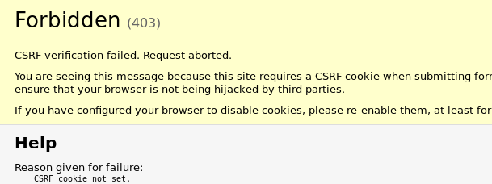

Lo siguiente que haremos en nuestro website es crear un apartado para agregar y editar posts. Django `admin` está bien cuando apenas estamos implementando nuestros modelos, pero es bastante difícil de ponerlo de manera presentable para el usuario común ademas de personalizarlo. Con los formularios de Django(forms) tendremos un poder absoluto sobre nuestra interfaz.

Lo bueno de los formularios de Django es que podemos definirlos desde cero o crear un "formulario de modelo" o `ModelForm`, que generará el código de formulario HTML a partir de los datos del modelo. Como hemos visto hasta ahorita, cada elemento del código esta dividido en su propio archivo, esto no es diferente con los formularios los cuales podemos crear en el archivo `forms.py` dentro del folder de nuestra aplicación (`blog`).

```bash
blog
   └── forms.py
```

Creamos el archivo, lo abrimos, y vamos a escribir el siguiente código:

```python
from django import forms
from .models import Post

class PostForm(forms.ModelForm):
    class Meta:
        model = Post
        fields = ('title', 'text',)
```

Aquí estamos importando la libreria `forms` de Django (`from django import forms`). También importamos nuestro modelo `Post` (`from .models import Post`) que usaremos m;as abajo.

La clase `PostForm`, como probablemente sospechas, es el nombre de la clase que construirá el formulario por nosotros a partir de nuestro modelo. Necesitamos decirle a Django que esta clase heredara de `ModelForm`, que es la libreria de Django que define como los atributos de un modelo son convertidos a código HTML y selecciona el tipo de entrada correcta en base al tipo de dato de cada atributo (texto, caracteres, números, fechas, etc).

A continuación, tenemos `class Meta`, donde estamos indicando a Django qué nuestra clase `PostForm` tendra información de contexto (también llamada metadatos), en este caso le estamos indicando que modelo es el que usará para generar el formulario (`model = Post`) y cuales de esto campos son los que queremos que muestre (`fields = ('title', 'text',)`).

Y con esto tenemos definida la clase que utilizará Django para crear el formulario por nosotros, lo único que nos falta es crear un objeto a partir de esta clase y dárselo a una plantilla para que lo muestre.

Ahora vamos a repetir el ciclo de vida de una petición para lograr el objetivo propuesto al inicio, tenemos que; definir e implementar un patron de URL desde alguna plantilla pre-existente, crear el patron en `urls.py`, crear la vista correspondiente en `views.py` donde crearemos nuestro objeto `PostForm`, y al pasaremos este objeto a una nueva plantilla donde se mostrará el formulario generado a partir de nuestro modelo `Post` con lso campos `title` y `text`.

### Implementar el patron de URL `post_new`

Es hora de abrir `blog/templates/blog/base.html`. Vamos a añadir el siguiente enlace dentro de la etiqueta `div` que está definida con la clase `page-header`:

```html
<a href="" class="top-menu"><span class="glyphicon glyphicon-plus"></span></a>
```

Estamos definiendo un nuevo patron de URL de nombre `post_new` (que todavía no creamos). La clase usada para esta entrada es `"glyphicon glyphicon-plus"`, esta es una clase definida por el framework `bootstrap` que estamos usando, y lo que hace es que dibuja un icono con el signo de mas (`+`) para nosotros. En esencia estamos creado un botón.

{}
Puedes encontrar más información sobre los Glypicons de Bootstrap en la [documentación oficial](https://getbootstrap.com/docs/3.3/components/).
{}

Después de agregar la línea de código, tu archivo HTML debería tener este aspecto:

```html

<html>
    <head>
        <title>DAW blog</title>
        <link rel="stylesheet" href="//maxcdn.bootstrapcdn.com/bootstrap/3.2.0/css/bootstrap.min.css" />
        <link rel="stylesheet" href="//maxcdn.bootstrapcdn.com/bootstrap/3.2.0/css/bootstrap-theme.min.css" />
        <link rel="stylesheet" href="https://fonts.googleapis.com/css2?family=Crimson+Text:wght@600&display=swap" />
        <link rel="stylesheet" href="" />
        <link rel="shortcut icon" type="image/png" href="" />
    </head>
    <body>
        <div class="page-header">
            <a href="" class="top-menu"><span class="glyphicon glyphicon-plus"></span></a>
            <h1><a href="/">DAW Blog</a></h1>
        </div>
        <div class="content container">
            <div class="row">
                <div class="col-md-8"> </div>
            </div>
        </div>
    </body>
</html>
```

Luego de guardar y actualizar la página `http://127.0.0.1:8000` obviamente verás un error del tipo `NoReverseMatch`, que ya nos es familiar - necesitamos crear nuestro patron de URL.

### Crear el patron de URL `post_new`

Abrimos el archivo `blog/urls.py` y añadimos una línea a los patrones de URL:

```python
path('post/new/', views.post_new, name='post_new'),
```

Y el código final tendrá este aspecto:

```python
from django.urls import path
from . import views

urlpatterns = [
    path('', views.post_list),
    path('post/<int:pk>/', views.post_detail, name='post_detail'),
    path('post/new/', views.post_new, name='post_new'),
]
```

Después de actualizar nuestro sitio, veremos un `AttributeError`, puesto que no hemos creado la vista `post_new`. Vamos a solucionarlo.

### Crear la vista `post_new`

Es el momento de abrir el archivo `blog/views.py` e importar nuestra clase `PostForm` para utilizarla en nuestra nueva vista, recondermos que nuestra clase est;a en el archivo `forms.py`, quedaria así al inicio de nuestro archivo:

```python
from .forms import PostForm
```

y ahora creamos nuestra vista al final del archivo:

```python
def post_new(request):
    form = PostForm()
    return render(request, 'blog/post_edit.html', {'form': form})
```

Para crear un nuevo objeto de formulario a partir de nuestro método `Post`, tenemos que llamar al constructor de la clase `PostForm`. Despues tenemos que pasar como argumento este objeto a una nueva plantilla llamada `post_edit`.

{}
Posiblemente te preguntas - "si nuestro patron URL y nuestra vista se llamas `post_new`", ¿por qué nuestra plantilla se llama `post_edit`? La respuesta es que esta plantilla la vamos a reutilizar más a delante para editar nuestros post, no solo para crearlos.
{}

### Crear la plantilla `post_new`

Tenemos que crear un archivo de nombre `post_edit.html` en el directorio de nuestras plantillas (`blog/templates/blog/`). Para hacer que el formulario generado por Django funcione en nuestra plantilla necesitamos varias cosas:

-   primero y lo más importante es mostrar el formulario. Podemos hacerlo, por ejemplo, con un simple template tag `{{ form.as_p }}`.
-   la línea anterior tiene que estar dentro de una etiqueta de formulario de HTML: `<form method="POST">...</form>`
-   necesitamos un botón que diga por ejemplo `Guardar`. Este lo podemos crear con HTML: `<button type='submit'>Guardar</button>`
-   y finalmente justo después de la apertura de `<form...>` necesitamos agregar ``. Esto es muy importante ya que hace que tus formularios sean seguros, Django se quejará si te olvidas de esta parte cuando intentes guardar el formulario. Por ejemplo:



Bueno, vamos a ver cómo quedará el template de nombre `post_edit.html`:

```html
 
<h2>Nuevo post</h2>
<form method="POST" class="post-form">
     {{ form.as_p }}
    <input type="submit" class="btn btn-default" value="Guardar" />
</form>

```

Es hora de actualizar.


¿Qué pasa si escribes algo en los campos `títle` y `text` y tratas de guardar los cambios?, nada. Una vez más estamos en la misma página y el texto se ha borrado... no se añade ningún post nuevo si regresamos a la página principal.

Para resolver esto tenemos que trabajar un poco más en nuestra vista. Si recuerdas creamos un objeto `PostForm` y lo enviamos a la plantilla, pero en ningún momento hemos creado un objeto de tipo `Post` ni le hemos dicho que va hacer con la información de ese formulario.

### Guardar la información del formulario

Abre `blog/views.py` una vez más. Actualmente, lo que tenemos en la vista `post_new` es:

```python
def post_new(request):
    form = PostForm()
    return render(request, 'blog/post_edit.html', {'form': form})
```

Normalmente cuando intentamos guardar un formulario vamos a ser redirigidos a esta misma vista, con la diferencia que esta vez tendremos los datos del formulario en el objeto `request` que se pasa como argumento a la vista. Para ser más específicos la información estará en `request.POST` (el nombre no tiene nada que ver con un post del blog, se refiere método _POST_ de _HTTP_).

¿Recuerdas que en el archivo HTML la definición de la etiqueta `<form>` tenía el atributo `method="POST"`?, esto indica que al enviar el nuevo request todos los campos del formulario serán enviados junto con este y estarán en `request.POST`. Seria erroneo cambiar el valor del atributo `method`, el único otro método compatible es `GET`, pero no nos es util para enviar información al servidor.

En nuestra vista tenemos dos posibles situaciones a contemplar:

1. cuando accedemos a la página por primera vez y queremos un formulario en blanco.
2. cuando volvemos a la vista con la información del formulario que acabamos de llenar.

Para tratar cada una de estas situaciones de manera diferente, pero dentro de la misma vista, tenemos que añadir una condición. Revisaremos que nuestro método sea `POST` cuando trae información, de lo contrario estamos creando un formulario en blanco.

```python
if request.method == "POST":
    [...]
else:
    form = PostForm()
```

Es hora de llenar los puntos `[...]`. Si el método es `POST`, queremos construir el objeto `PostForm` con los datos del formulario, lo haremos pasando la información del request a nuestro formulario:

```python
form = PostForm(request.POST)
```

Lo siguiente será verificar que la información del formulario es correcta (todos los campos necesarios están definidos y no hay valores incorrectos). Esto lo logramos con un método que son provee la clase `ModelForm` de nombre `is_valid()`. Así comprobamos que el formulario es válido y, si es así, ¡lo podemos salvar!

```python
if form.is_valid():
    post = form.save(commit=False)
    post.author = request.user
    post.published_date = timezone.now()
    post.save()
```

Básicamente, estamos haciendo dos cosas aquí: guardando el formulario en un objeto de tipo `Post` con el método `form.save`, y añadiéndole el autor (ya que no había ningún campo de `author` en el `PostForm` y este campo es obligatorio). La opción `commit=False` significa que no queremos guardar el modelo `Post` en la base de datos (todavía) - queremos modificar este post un poco añadiendo más información (como el autor) antes de guardarlo. La mayoría de las veces utilizarás `form.save()`, sin `commit=False`, pero en este caso, tenemos que hacerlo para incluir esta información que también viene en el request dependiendo del usuario que esté autenticado. La línea `post.save()` conservará los cambios que hicimos guardando el objeto en la base de datos.

Por último, sería genial si al momento de crear un nuevo post nos redirija automáticamente a la página de detalle del mismo. Para hacerlo necesitamos importar el modulo `redirect`, que como su nombre lo indica nos sirve para redirigir un request. Agrega esto al inicio del archivo:

```python
from django.shortcuts import redirect
```

Y ahora podemos decirle a la vista `post_new`: "Redirige al template `post_detail` del post recién creado".

```python
return redirect('post_detail', pk=post.pk)
```

`post_detail` es el nombre del patron URL a donde queremos ir, ya que ste nos llevará a la vista `post_detail`. Recuerda que esta vista requiere una variable de llave primaria llamada `pk`, y precisamente con `pk=post.pk` le indicamos la llave primaria de este post. Despues de todo esto nuestra vista `post_new` quedaria así:

```python
def post_new(request):
    if request.method == "POST":
        form = PostForm(request.POST)
        if form.is_valid():
            post = form.save(commit=False)
            post.author = request.user
            post.published_date = timezone.now()
            post.save()
            return redirect('post_detail', pk=post.pk)
    else:
        form = PostForm()
    return render(request, 'blog/post_edit.html', {'form': form})
```

Vamos a ver si funciona. Ve a la página <http://127.0.0.1:8000/post/new/>, añade un `title` y un `text`, guardalo... ¡y voilà! Se añade el nuevo post al blog y se nos redirige a la página de detalle del post.

Probablemente has visto que no hemos definido la fecha de publicación. Vamos a introducir un _botón publicar_ en otra sección mas adelante.

{}
Como recientemente hemos utilizado la interfaz de administrador de Django, el sistema piensa que hemos iniciado sesión. Hay algunas situaciones que podrían llevarnos a desconectarnos (cerrando el navegador, reiniciando la base de datos, etc.). Si estás recibiendo errores al crear un post que indican la falta de inicio de sesión de usuario, dirígete a la página de administración `http://127.0.0.1:8000/admin` e inicia sesión nuevamente. Esto resolverá el problema temporalmente. Hay una forma más completa de como arreglar este problema en una sección más adelante.

{}

### Validar la información del formulario

Es tiempo de ver otra de las características que nos proveen los formularios de Django, la validación automática. Es de nuestro conocimiento que un post debe tener los campos `title` y `text`, en nuestro modelo `Post` no especificamos (a diferencia de `published_date`) que estos campos no fueran requeridos, así que Django por defecto espera que existan. Trata de guardar el formulario sin `title` y `text`.


Django se encargará de validar que todos los campos en el formulario sean correctos, y en caso de que esto no sea así automáticamente mostrará un mensaje al usuario haciéndole saber que esta mal.

### Reutilizar la plantilla para edición

Es tiempo de ver como podemos reutilizar una plantilla en diferentes vistas, y ver porqué nuestra plantilla fue nombrada `post_edit.html`. Esta vez el proceso será un poco más rápido ya que sabemos los pasos a realizar: implementar un patron de YRL en alguna vista, crear el patron en `urls.py`, y crear la vista en `views.py` - esta vez no ocupamos template porque ya lo tenemos.

{}
**Tip**
\
Si algo del siguiente proceso no te queda claro, recuerda revisar las secciones anteriores, son temas que ya se han cubierto. En caso de que sigas con dudas, siempre puedes acudir al foro de dudas.
{}

Abre el archivo `blog/templates/blog/post_detail.html` y añade esta línea justo antes del `if` de la fecha de publicación:

```html
<a class="pull-right btn btn-default" href=""><span class="glyphicon glyphicon-pencil"></span></a>
```

nuestra plantilla deberá verse así:

```html
 
<div class="post">
    <a class="pull-right btn btn-default" href=""><span class="glyphicon glyphicon-pencil"></span></a>
    
    <div class="date">
        <p>{{ post.published_date }}</p>
    </div>
    
    <h2>{{ post.title }}</h2>
    <p>{{ post.text|linebreaksbr }}</p>
</div>

```

En el archivo `blog/urls.py` añadimos este nuevo patron:

```python
path('post/<int:pk>/edit/', views.post_edit, name='post_edit'),
```

Vamos a reutilizar la plantilla `blog/templates/blog/post_edit.html`, así que lo último que nos falta es crear una nueva vista. Abramos el archivo `blog/views.py` y añadamos al final del mismo este código:

```python
def post_edit(request, pk):
    post = get_object_or_404(Post, pk=pk)
    if request.method == "POST":
        form = PostForm(request.POST, instance=post)
        if form.is_valid():
            post = form.save(commit=False)
            post.author = request.user
            post.published_date = timezone.now()
            post.save()
            return redirect('post_detail', pk=post.pk)
    else:
        form = PostForm(instance=post)
    return render(request, 'blog/post_edit.html', {'form': form})
```

Esta vista se muy similar a nuestra vista `post_new`, pero no es así del todo. Primero que nada nuestra vista está recibiendo un parametro `pk` para identificar el post al que se hará referencia. Despues con este parametro `pk` estamos obteniendo el objeto `Post` (en la línea `get_object_or_404(Post, pk=pk)`) desde nuestra base de datos, el cual vamos a editar. Y posteriormente al crear nuestro objeto `PostForm` pasamos como parametro nuestro objeto post (en la línea `form = PostForm(request.POST, instance=post)`) para que el formulario sea pre-llenado con la información del mismo.

Dirígete a la página `post_detail`. Debe haber ahí un botón para editar en la esquina superior derecha:


Al dar clic es ese botón te deberia de enviar a la pagina generada por la plantilla `post_edit.html` donde cargará nuestro formulario con la información del post indicado:


Siéntete libre de cambiar el título o el texto y guarda los cambios.

{}
Si necesitas más información sobre los formularios de Django ve a la [documentación oficial](https://docs.djangoproject.com/en/3.1/topics/forms/).
{}

### Medidas de seguridad

Ser capaz de crear nuevos post solo con presionar un botón esta de lujo. Pero una cosa que debería de dar de que preocuparnos es a quíen vamos a permitir crear esos posts. En este momento, cualquier usuario que visite tu sitio será capaz de crear nuevos posts. Vamos a cambiar esto agregando una capa de seguridad muy simple, evitar que los botónes para crear y editar posts se muestre si eres un usuario **no** autenticado.

En `blog/templates/blog/base.html`, encuentra la etiqueta `div` con la clase `page-header`, dentro deberia de estar una etiqueta ancla (`<a>`) que insertaste anteriormente. Se debe de ver algo así:

```html
<a href="" class="top-menu"><span class="glyphicon glyphicon-plus"></span></a>
```

Agregaremos otra template tag `` rodeando esta etiqueta ancla, lo cual hará botón aparecer solo para usuarios que hayan iniciado sesión — en este momento, solo los usuarios creados con `createsuperuser`. Deberia de quedar algo así:

```html

<a href="" class="top-menu"><span class="glyphicon glyphicon-plus"></span></a>

```

Toma en cuenta que esto **no** va a proteger completamente contra la creación de posts por usuarios no autorizados, pero es un kuy simple primer paso. Se verá mas sobre seguridad en otra sección más adelante.

También vamos a encerrar en un template tag similar al botón de edición que creamos una hace un momento, así usuarios no autenticados no serán capaces de editar posts existentes tan fácilmente. Abre `blog/templates/blog/post_detail.html` y encuentra este código:

```html
<a class="pull-right btn btn-default" href=""><span class="glyphicon glyphicon-pencil"></span></a>
```

cambialo a este otro:

```html

<a class="pull-right btn btn-default" href=""><span class="glyphicon glyphicon-pencil"></span></a>

```

Ya que seguramente haz iniciado sesión, actualiza la pagina, no veras nada diferente. Carga la página en un navegador diferente o en una ventana de incógnito, veras que los botones no se muestran.

## Desplegar a producción

De nuevo; hemos hecho cambios en nuestro ambiente de desarrollo, hicimos algunas pruebas, y todo funciona correctamente. Es momento de desplegar la aplicación a nuestro servidor de producción.

Primero haz un punto de salvado (`commit`) de tu nuevo código, y haz `push` a tu repositorio remoto.

```bash
cd ~/django-daw
git status
git add .
git status
git commit -m "se agregaron vistas para crear y editar posts dentro del blog"
git pull
git push
```

Luego en una [consola Bash de PythonAnywhere](https://www.pythonanywhere.com/consoles/), descarga el nuevo código.

```bash
cd ~/gallegosj89.pythonanywhere.com
git pull
```

Finalmente, ve a la pestaña [Web](https://www.pythonanywhere.com/web_app_setup/) y haz click en **Reload**.
