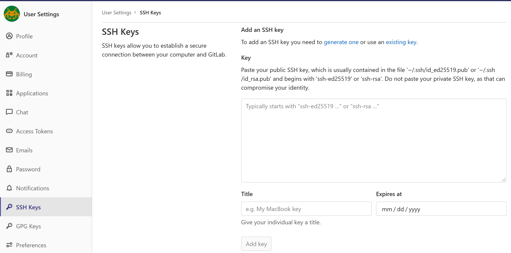
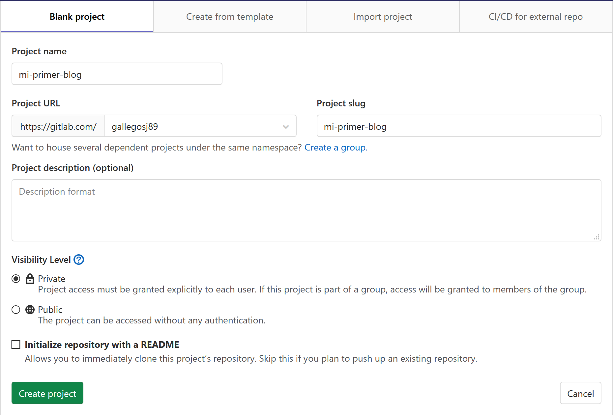
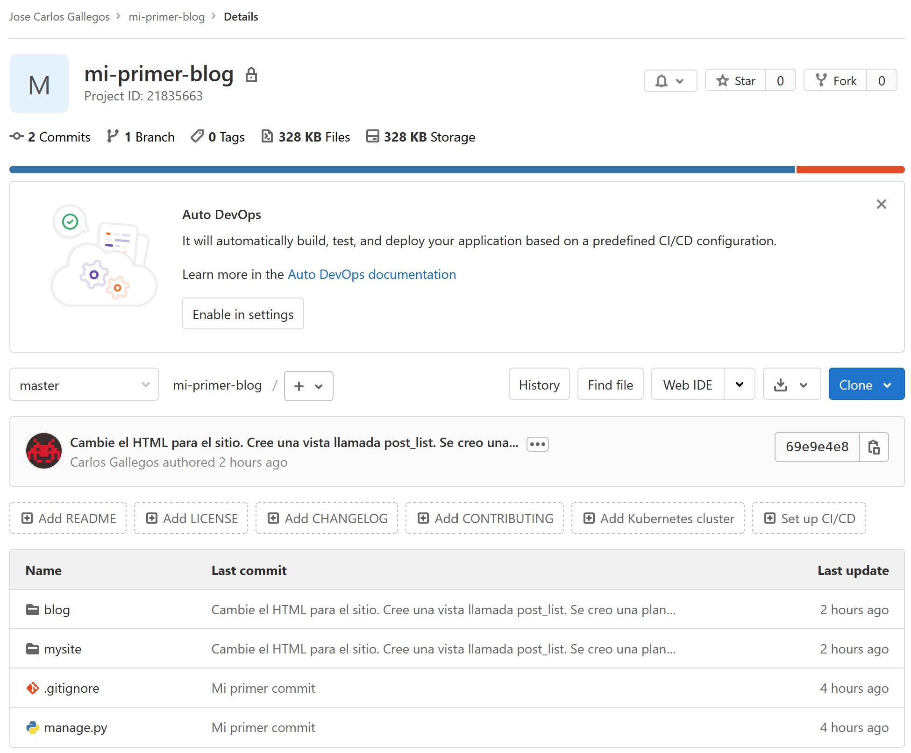
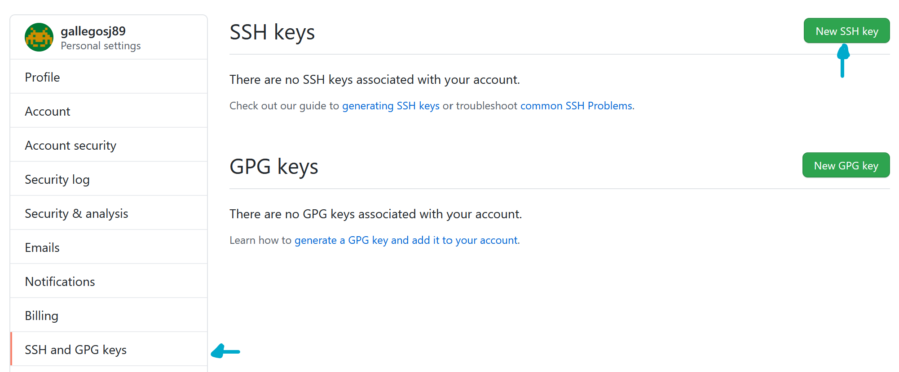
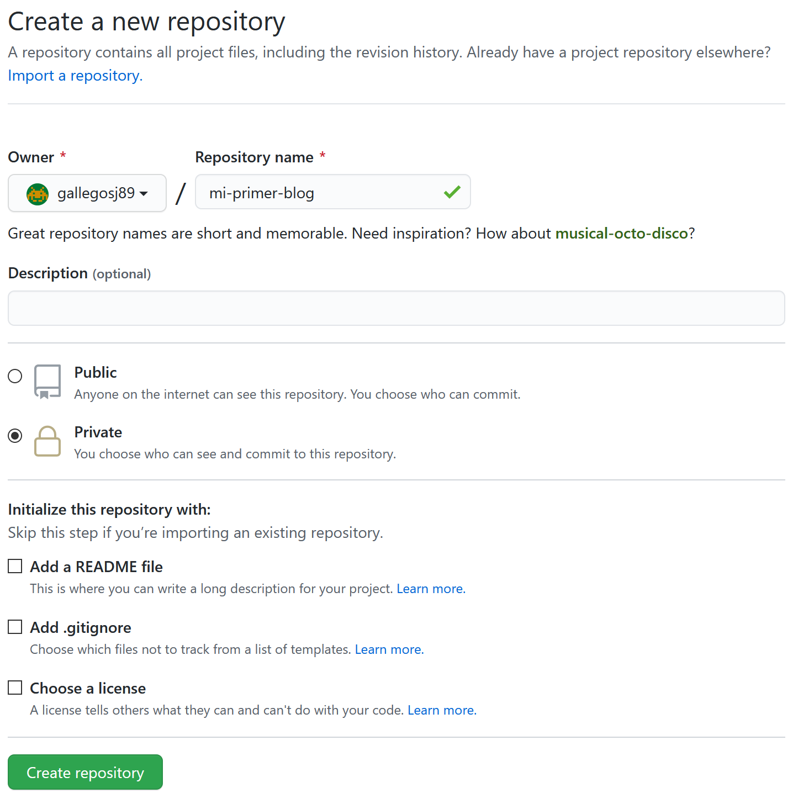
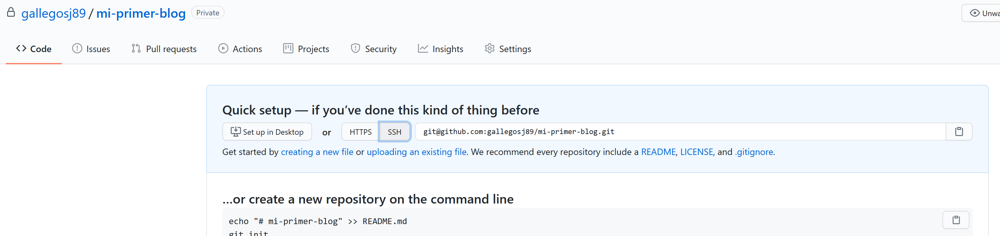
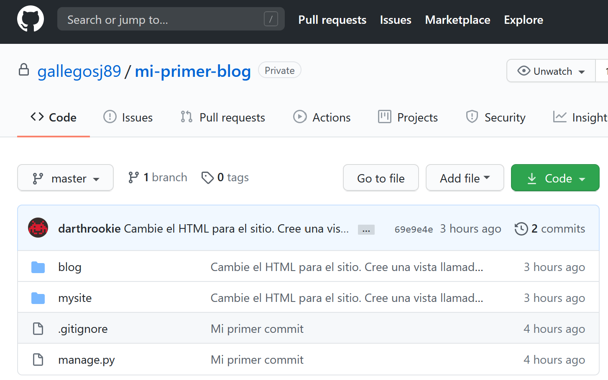

{}
La siguiente parte de este tutorial puede ser a veces un poco difícil de superar. Se persistente y acábala, el despliegue es una parte importante del proceso en el desarrollo web.
{}

Hasta ahora tu sitio web estaba disponible sólo en tu ordenador, ahora aprenderás cómo desplegarlo. El despliegue es el proceso de publicar tu aplicación en Internet para que la gente pueda acceder a ella.

Como se vio anteriormente, un sitio web tiene que estar en un servidor. Hay muchos proveedores de servidores, ene ste tutorial usaremos uno que tiene un proceso de despliegue relativamente simple: [PythonAnywhere](https://pythonanywhere.com/). PythonAnywhere es gratis para pequeñas aplicaciones que no tienen necesitan demasiados recursos y que no tienen una grande cantidad de trafico, en otras palabras, ideal para nuestro caso de uso.

Ademas de un servidor web, necesitamos un servidor que aloje el código base de nuestra aplicación web. Nosotros podemos alojar este servidor, pero en esta era de telecomunicaciones xisten una gran multitud de servicios que nos permiten realizar esto. Para poder elegir el servicio correcto para nuestro proposito necesitamos tener las siguientes consideraciones:

1. Nos permita alojar nuestro código fuente
2. Sea gratuito
3. Nos permita acceder al código de manera segura
4. Nos permita colaborar con otras personas en el código
5. Haga un seguimiento de los cambios en el código
6. (opcional) Nos permita hacer el despliegue automatico de nuestro código

Existe una herramienta que cumple con los requisitos 4 y 5, esta herramienta es llamada _Git_. Ahora bien, existen un multitud de servicios en linea que proveen acceso a el almacenamiento de código en la nube que utilizan _Git_ como protocolo de acceso. De estos servicios dos que cumplen perfectamente el resto de requisitos, estos servicios se llaman [_Github_](https://github.com/) y [_Gitlab_](https://gitlab.com/).

Veamos más de estas herramientas y servicios en las siguientes secciones.

## Git

Git es un "sistema de control de versiones" usado por muchos programadores - es un sistema que registra los cambios en los archivos a través del tiempo de forma tal que puedas acceder a versiones específicas cuando lo desees. Es muy similar a la opción de "registrar cambios" en Microsoft Word, pero mucho más poderoso.

### Iniciar nuestro repositorio Git

Git rastrea los cambios realizados a un grupo determinado de archivos en lo que llamamos un repositorio de código (o "repo" para abreviar). Iniciemos uno para nuestro proyecto. Abre la consola y ejecuta los siguientes comandos en el directorio de de tu proyecto (ej. `django-daw`):

{}
Recuerda entrar al directorio de tu proyecto, puedes llegar allí con `cd ~/django-daw` o `cd %userprofile%\django-daw`. Despues inicia el entorno virtual.
{}

```bash
$ git init
Initialized empty Git repository in ~/django-daw/.git/
$ git config --global user.name "Tu nombre"
$ git config --global user.email tu@ejemplo.com
```

Inicializar el repositorio git es algo que sólo necesitamos hacer una vez por proyecto (y no tendrás que volver a poner tu usuario y correo electrónico nunca más)

Git llevará un registro de los cambios realizados en todos los archivos y directorios en este proyecto, pero hay algunos archivos que queremos que ignore. Esto lo hacemos creando un archivo llamado `.gitignore` en el directorio base. Abre tu editor y crea un nuevo archivo con el siguiente contenido:

```bash
*.pyc
*~
__pycache__
env
db.sqlite3
/static
.DS_Store
```

Y guárdalo como `.gitignore` en el directorio principal del proyecto (`django-daw`).

{}
¡El punto al principio del nombre del archivo es importante! Si tienes dificultades para crearlo, usa la opción "Guardar como" en tu editor, eso no falla.
{}

{}
**Nota:** Uno de los archivos especificados en `.gitignore` es `db.sqlite3`. Este archivo es tu base de datos local, donde todos los posts son almacenados. No queremos agregar esta base de datos al repositorio porque nuestro sitio de PythonAnywhere va a usar una base de datos diferente. El manejador de base de datos podría ser SQLite, como en tu maquina local, pero usualmente se utiliza MySQL que puede lidiar con muchos mas visitantes al sitio. De cualquier manera, ignorando tu copia de base de datos para la copia del proyecto en Github, significa que todos tus post creados hasta el momento se quedaran y solo estarán accesibles de manera local, pero tendrás que agregarlos de nuevo en producción. Debes de pensar en tu base de datos local como un campo de juego donde puedes probar cosas diferentes y no tener miedo de borrar tus posts reales en el blog remoto.
{}

Es buena idea utilizar el comando `git status` antes de `git add` o cuando no estés seguro de lo que va a hacer, para evitar cualquier sorpresa (por ejemplo, añadir o hacer commit de archivos no deseados). El comando `git status` devuelve información sobre los archivos sin seguimiento (untracked), modificados, preparados (staged), el estado de la rama y mucho más. La salida debería ser similar a:

```bash
$ git status
On branch main

Initial commit

Untracked files:
    (use "git add <file>..." to include in what will be committed)

.gitignore
blog/
manage.py
mysite/

nothing added to commit but untracked files present (use "git add" to track)
```

Y finalmente guardamos nuestros cambios. Ve a la consola y ejecuta estos comandos:

```bash
$ git add .
$ git commit -m "Mi primer commit"
[...]
13 files changed, 200 insertions(+)
create mode 100644 .gitignore
[...]
create mode 100644 mysite/wsgi.py
```

### Creando nuestra llave de seguridad

Es muy importante cuando trabajamos con _Git_ y repositorios remotos que reforcemos la seguridad. Para esto se utilizan un protocolo de comunicación llamado _SSH_ que utiliza llaves asimétricas (publica y privada). Necesitas generar un par de llaves en tu computadora, para esto ejecuta el siguiente comando en la terminal:




```sh
ssh-keygen -b 4096 -t rsa -C laptop
```




Para entender este comando vamos a dividirlo en sus diferentes partes:

-   `ssh-keygen` es el comando para generar un par de llaves SSH
-   `-b 4090` el parametro `-b` indica de cuantos bits será la llave, aquí le decimos que sea de `4096` bits
-   `-t rsa` le indicamos que la llave que queremos es de tipo `rsa`, este es el tipo de llave más común para trabajar con _Git_ y suficientemente segura
-   `-C laptop` este es solo un comentario para identificar la llave, aquí puedes elegir el comentario que identifique la máquina donde este par de llaves será usado

Al ejecutar este comando se te pedirá donde quieres guardar la llave, deja el directorio y nombre por defecto `~/.ssh/id_rsa`. Despues te pedirá una contraseña, tienes la opción de dejarlo en blanco o introducir una contraseña (toma en cuenta que cuando escribas los caracteres no aparecerán en la pantalla), si eliges ponerle una contraseña a tus llaves es más seguro - pero te pedirá está cada vez que quieras usar las llaves.

{}
**tip**
/
Para efectos de este tutorial te recomiendo no usar contraseña, esto hará todo fluir de manera más transparente.
{}

Ene ste punto se ha creado el par de llaves. Tu llave privada es el archivo `id_rsa` que se encuentra en `~/.ssh` o `%userprofile%\.ssh`, este es usado por tu máquina y por _Git_ de manera automática. Tu llave pública es el archivo `id_rsa.pub`, este o su contenido es el que tienes que compartir con los servicios que quieras tener comunicación segura. Para ver el contenido de tu llave pública ejecuta el siguiente comando.




```sh
cat ~/.ssh/id_rsa.pub
```




```bat
type %userprofile%\.ssh\id_rsa.pub
```




## Enviando nuestro código a la nube

Ahora vamos a crear nuestra cuenta en uno de los servicios de almacenamiento de código, puedes elegir cualquiera de los dos servicios. Intenta leer o investigar un poco sobre cada uno y elige el que más te guste.


{}

Visita [Gitlab](https://www.gitlab.com) y registra una nueva cuenta de usuario gratuita (posiblemente ya la tengas si estas siguiendo este tutorial).

### Agrega tu llave pública

Una de las primeras cosas que debemos hacer es agregar nuestra llave pública a nuestra cuenta de Gitlab, esto nos provee mayor seguridad y asegura que nadie tenga acceso a escribir a nuestro repositorio si no le damos el permiso por medio de llaves.

Vamos a ir al menu superior derecho, donde aparece nuestro avatar, y al dar entrar seleccionamos la opción `Settings`.


En las preferencias de tu cuenta de Gitlab del lado izquierdo encontraremos la opción `SSH Keys`, al seleccionarla nos aparecerá un formulario donde pegar nuestra llave publica, agregar un titulo y una fecha de expiración de ser necesario.



### Crea tu nuevo proyecto

Debido a que Gitlab es una herramienta que no solo sirve para almacenar repositorios de código sino también para dar seguimiento a proyectos, hacer deployment de aplicaciones, hostear páginas web estáticas (como este tutorial), entre otras cosas. Aquí creamos un proyecto y dentro automáticamente se creará un repositorio, para esto ve a la pagina principal y da en el botón _New project_.


En `Project name` escribe _mi-primer-blog_, en `Visibility level` selecciona _Private_, y deja desmarcada la opción `Initialize repository with a README`. Esto configurará el proyecto como privado y dejará el repositorio vacío para nosotros subir nuestro código.



{}
**Nota:** El nombre `mi-primer-blog` es importante. Podrías elegir otra cosa, pero va a aparecer muchas veces en las instrucciones que siguen y tendrías que sustituirlo cada vez. Si eliges otro nombre solo recuerda sustituir apropiadamente en las instrucciones.
{}

En la siguiente pantalla verás la URL para clonar tu repositorio dentro de la opción `Clone`. Elige copiar la URL de tipo _SSH_ ya que antes configuramos nuestro account con nuestra llave publica.


### Enlazando tu repositorio

Ahora tenemos que enlazar tu repositorio _local_ con el _remoto_ que está en Gitlab. Para esto utilizaremos el comando `git remote add`, ya que con _Git_ podemos enlazar nuestro repositorio local con varios repositorios/servicios remotos, debemos proveer un nombre para este _remoto_ en Gitlab. Cuando solo tenemos un remoto que agregar por convención se utiliza `origin` como nombre. Además de un nombre también debemos darle la _URL_ de nuestro repositorio, la cual copiamos anteriormente. Algo así:

```bash
git remote add origin git@gitlab.com:gallegosj89/mi-primer-blog.git
```

{}
No olvides usar la URL de **tu** repositorio y no la que aparece en este tutorial.
{}

Una vez enlazado nuestro repositorio, solo nos queda *"empujar"* los cambios locales para que se guarden en nuestro repositorio remoto. Para esto utilizamos el siguiente comando, donde le decimos a _Git_ que mande nuestro código al remoto de nombre `origin`, a la rama `main`, y con la opción `-u` (que solo será utilizada esta vez) le decimos que nuestra rama local `main` le dará seguimiento a la rama remota en el futuro.

```bash
git push -u origin main
```

Una vez los cambios estén arriba, deberías de poder ver los archivos de tu repositorio en Gitlab.



{}
{}

Visita [Github](https://www.github.com) y registra una nueva cuenta de usuario gratuita.

### Añade tu llave pública

Una de las primeras cosas que debemos hacer es agregar nuestra llave pública a nuestra cuenta de Github, esto nos provee mayor seguridad y asegura que nadie tenga acceso a escribir a nuestro repositorio si no le damos el permiso por medio de llaves.

Vamos a ir al menu superior derecho, donde aparece nuestro avatar, y al entrar seleccionamos la opción `Settings`.


En las preferencias de tu cuenta de Github del lado izquierdo encontraremos la opción `SSH and GPG keys`, al entrar dar clic en el botón `New SSH Key.



En esta nueva vista agregar un titulo a la llave, de preferencia el texto que usaste en el comentario al generar la llave, y en el campo `key` pegar el contenido de la llave pública. Para terminar clic en `Add SSH key`.


### Crea tu nuevo repositorio

Para crear un nuevo repositorio, entra en la ventana principal de _Github_ (dando clic en el logo de arriba a la izquierda) y despues clic en `Create repository`.


Ahora hay que llenar el formulario de creación con el nombre _mi-primer-blog_, marca el repositorio como `Private`, desmarca la opción `Add a README file`, desmarca la opción `Add .gitignore`, y desmarca la opción `Choose a license`.



{}
**Nota:** El nombre `mi-primer-blog` es importante. Podrías elegir otra cosa, pero va a aparecer muchas veces en las instrucciones que siguen y tendrías que sustituirlo cada vez. Si eliges otro nombre solo recuerda sustituir apropiadamente en las instrucciones.
{}

En la próxima pantalla verás la URL para clonar tu repositorio. Elige la versión `SSH`, cópiala y en un momento la pegaremos en la consola.



### Enlaza tu repositorio

Ahora tenemos que enlazar tu repositorio _local_ con el _remoto_ que está en Github. Para esto utilizaremos el comando `git remote add`, ya que con _Git_ podemos enlazar nuestro repositorio local a varios repositorios/servicios remotos, debemos proveer un nombre para este _remoto_ en Github. Cuando solo tenemos un remoto que agregar por convención se utiliza `origin` como nombre. Además de un nombre, también debemos darle la _URL_ de nuestro repositorio, la cual copiaste anteriormente. Algo así:

```bash
git remote add origin git@github.com:gallegosj89/mi-primer-blog.git
```

{}
No olvides usar la URL de **tu** repositorio y no la que aparece en este tutorial.
{}

Una vez enlazado nuestro repositorio, solo nos queda "empujar" los cambios locales para que se guarden en nuestro repositorio remoto. Para esto utilizamos el siguiente comando, donde le decimos a _Git_ que mande nuestro código al remoto de nombre `origin`, a la rama `main`, y con la opción `-u` (que solo será utilizada esta vez) le decimos que nuestra rama local `main` le dará seguimiento a la rama remota en el futuro.

```bash
git push -u origin main
```

Una vez los cambios estén arriba, deberías de poder ver los archivos de tu repositorio en Github.



{}


## PythonAnywhere

Es hora de registrar una cuenta gratuita de tipo "Beginner" en PythonAnywhere.

-   [www.pythonanywhere.com](https://www.pythonanywhere.com/)

{}
**Nota:** Cuando elijas tu nombre de usuario ten en cuenta que la URL de tu blog tendrá la forma `nombredeusuario.pythonanywhere.com`, así que o bien elije tu propio alias o bien un nombre que describa sobre qué trata tu blog.
{}

### Creando un API token de PythonAnywhere

Esto es algo que solo ocupas realizar una vez. Cuando te hayas registrado en PythonAnywhere, serás tomado a tu página principal (Dashboard). Encuentra el enlace cerca de la esquina derecha de la pagina que te lleva a la pagina de cuenta (Account), luego selecciona la pestaña con el nombre "API token", y presiona el botón que dice "Create new API token".


### Configurando nuestro sitio en PythonAnywhere

Regresa a la pagina principal [Dashboard](https://www.pythonanywhere.com/) haciendo click en el logo (la viborita), y elige la opción de iniciar una nueva consola de "Bash" — esa el version de la línea de comando de PythonAnywhere, justo como la que tienes en tu maquina virtual.


Desplegar una aplicación web en PythonAnywhere significar jalar (pull) el código que tenemos en nuestro repositorio de Github, y entonces configurar PythonAnywhere para reconocerlo e iniciar a servirlo como aplicación web. Hay maneras manuales de como hacerlo, pero PythonAnywhere provee una herramienta de ayuda que lo hará por ti. Vamos a instalarla primero:

```bash
python3.7 -m pip install --user -U pythonanywhere
```

Ese comando debería de imprimir algo como `Collecting pythonanywhere`, y eventualmente terminar con una línea diciendo `Successfully installed (...) pythonanywhere- (...)`.

Antes de poder hacer `pull` de nuestro código tenemos que generar un par de llaves privada y pública, ademas de registrar la llave pública en nuestro repositorio (ya sea Gitlab o Github) como hicimos antes con la llave de nuestra máquina local. El comando para generar la llave SSH es el siguiente.

```sh
ssh-keygen -b 4096 -t rsa -C pythonanywhere
```

Solo da ENTER varias veces y se completará el proceso de creación de llaves. Para poder ver el contenido de la llave pública ejecuta:

```sh
cat ~/.ssh/id_rsa.pub
```

Ahora ejecutamos la herramienta de ayuda que automáticamente configura nuestra aplicación web en el servidor de PythonAnywhere. Escribe lo siguiente en la consola de PythonAnywhere (no olvides usar la liga SSH de **tu** repositorio).

```bash
pa_autoconfigure_django.py git@gitlab.com:gallegosj89/mi-primer-blog.git --python=3.7 --nuke
```

Mientras observas como se ejecuta, podrás ver lo que esta haciendo:

-   Descarga el código de tu repositorio
-   Crea un entorno virtual en tu servidor de PythonAnywhere, similar al que tienes en tu máquina virtual
-   Actualizando tu archivo de configuración agregando algunas configuraciones de despliegue
-   Configurando la base de datos en PythonAnywhere usando el comando `manage.py migrate`
-   Configurando los archivos estáticos (veremos mas de esto en otra práctica)
-   Y configurando PythonAnywhere para servir como aplicación web a través de su API

En PythonAnywhere todos esos pasos son automáticos, pero son los mismos pasos que debes seguir con cualquier otro servidor. Lo principal que debes notar ahora es que tu base de datos en PythonAnywhere es completamente diferente de tu maquina local—eso significa que tendrá diferentes posts y cuentas de administrador.

Como resultado, así como lo hicimos en la máquina virtual, necesitamos inicializar un usuario de administrador con `createsuperuser`. PythonAnywhere ha activado tu entorno virtual de manera automática, así que todo lo que necesitas hacer en ejecutar:

```sh
python manage.py createsuperuser
```

Escribe los detalles de tu usuario de administración. Es mejor usar los mismos que estabas usando en tu maquina virtual para evitar confusiones, a menos que quieras hacer el password de PythonAnywhere mas seguro.

Ahora, si así lo deseas, puedes dar un vistazo a tu código en PythonAnywhere utilizando `ls`:

```sh
(gallegosj89.pythonanywhere.com) gallegosj89.pythonanywhere.com $ ls
blog  db.sqlite3  manage.py  mysite  static
(gallegosj89.pythonanywhere.com) gallegosj89.pythonanywhere.com $ ls blog/
__init__.py  __pycache__  admin.py  forms.py  migrations  models.py  static
templates  tests.py  urls.py  views.py
```

También puedes ir a la pestaña de "Files" y navegar alrededor utilizando el navegador de archivos integrado de PythonAnywhere.

### Estas en vivo

Tu sitio debería esta ahora en vivo al publico en Internet. Da click a través de la pestaña "Web" en el dashboard de PythonAnywhere para obtener el enlace a tu página. Puedes compartir este enlace con quien desees.

{}
**Nota:** esta es una clase de introducción al desarrollo de las aplicaciones web, y desplegando este sitio se tomaron algunos atajos que no son ideales desde el punto de vista de seguridad. Si y cuando decidas construir sobre este proyecto, o iniciar uno nuevo, deberías de revisar la [lista de despliegue de Django](https://docs.djangoproject.com/en/3.1/howto/deployment/checklist/) para obtener algunos tips sobre seguridad en tu sitio.
{}

## Tips de debugging

Si ves algún error durante la ejecución del script `pa_autoconfigure_django.py`, aquí tienes una lista de las causas comunes:

-   Olvidaste crear tu API token en PythonAnywhere
-   Escribiste de manera incorrecta la URL de tu repositorio
-   Si ves un error diciendo _"Could not find your settings.py"_, es probable que no hayas subido todos tus archivos al repositorio remoto, y/o no hiciste _push_ de manera exitosa. Mira de nuevo a la sección [sobre enlazar nuestros repositorios](#enlazando-tu-repositorio) arriba en esta práctica

Si ves algún error al intentar visitar tu sitio, el primer lugar donde buscar información es el **error log**. Encontraras un enlace al mismo en la [pestaña Web](https://www.pythonanywhere.com/web_app_setup/) de PythonAnywhere. Revisa si hay algunos mensajes de error; los mas nuevos están hasta abajo.

También hay algunos tips en el [sitio de ayuda de PythonAnywhere](http://help.pythonanywhere.com/pages/DebuggingImportError).

Recuerda cualquier duda preguntar, o enviar un correo.

## Revisa tu sitio

La pagina por defecto de tu sitio debería de decir "It worked!", justo como se muestra en tu máquina local. Intenta añadir `/admin/` al final de la URL, y serás redirigido al sitio de administración de Django. Inicia sesión con tu usuario y contraseña, verás que puedes añadir Posts en el servidor.

Ya que hayas creado varios posts, puedes regresar a tu proyecto local. De aquí en adelante debes de trabajar en tu proyecto local y subir los cambios al repositorio remoto. Este es un flujo de trabajo normal en el desarrollo web — hacer cambios locales, subir esos cambio al remoto, y hacer `pull` de estos cambios en el servidor Web. Esto permite trabajar y experimentar sin romper el sitio Web que está en vivo.
