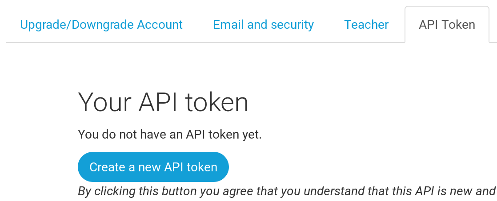

> **Nota**: La siguiente práctica puede ser a veces un poco difícil de superar. Se persistente y acábala. El despliegue es una parte importante del proceso en el desarrollo web.

Hasta ahora tu sitio web estaba disponible sólo en tu ordenador, ahora aprenderás cómo desplegarlo. El despliegue es el proceso de publicar tu aplicación en Internet para que la gente pueda acceder a ella.

Como se vio anteriormente, un sitio web tiene que estar en un servidor. Hay muchos proveedores, pero usaremos uno que tiene un proceso de despliegue relativamente simple: [PythonAnywhere](https://pythonanywhere.com/). PythonAnywhere es gratis para pequeñas aplicaciones que no tienen demasiados visitantes, definitivamente suficiente para este caso.

El otro servicio externo que vamos a utilizar es [GitHub](https://www.github.com), un servicio de alojamiento de código. Hay otras opciones por ahí, pero hoy en día casi todos los programadores tienen una cuenta de GitHub, y ahora tú también la vas a tener.

Usaremos GitHub como paso intermedio para transportar nuestro código desde y hasta PythonAnywhere.

## Git

Git es un "sistema de control de versiones" usado por muchos programadores - es un sistema que registra los cambios en los archivos a través del tiempo de forma tal que puedas acceder a versiones específicas cuando lo desees. Es muy similar a la opción de "registrar cambios" en Microsoft Word, pero mucho más poderoso.

### Instalar Git

Si no lo tienes ya instalado, git debería estar disponible a través del administrador de paquetes, prueba con:

```bash
    sudo apt-get install git
```

### Iniciar nuestro repositorio Git

Git rastrea los cambios realizados a un grupo determinado de ficheros en lo que llamamos un repositorio de código (o "repo" para abreviar). Iniciemos uno para nuestro proyecto. Abre la consola y ejecuta los siguientes comandos en el directorio de `django-daw`:

> **Nota**: Comprueba el directorio de trabajo actual con el comando `pwd` antes de inicializar el repositorio. Deberías estar en la carpeta `django-daw`.

```bash
    $ git init
    Initialized empty Git repository in ~/django-daw/.git/
    $ git config --global user.name "Tu nombre"
    $ git config --global user.email tu@ejemplo.com
```

Inicializar el repositorio git es algo que sólo necesitamos hacer una vez por proyecto (y no tendrás que volver a poner tu usuario y correo electrónico nunca más)

Git llevará un registro de los cambios realizados en todos los ficheros y carpetas en este directorio, pero hay algunos ficheros que queremos que ignore. Esto lo hacemos creando un fichero llamado `.gitignore` en el directorio base. Abre tu editor y crea un nuevo fichero con el siguiente contenido:

```bash
    *.pyc
    *~
    __pycache__
    env
    db.sqlite3
    /static
    .DS_Store
```

Y guárdalo como `.gitignore` en la primera carpeta "django-daw".

> **Nota**: ¡El punto al principio del nombre del fichero es importante! Si tienes dificultades para crearlo, usa la opción "Guardar como" en tu editor, eso no falla.
> **Nota**: Uno de los archivos especificados en `.gitignore` es `db.sqlite3`. Este archivo es tu base de datos local, donde todos los posts son almacenados. No queremos agregar esta base de datos al repositorio porque nuestro sitio de PythonAnywhere va a usar una base de datos diferente. El manejador de base de datos podría ser SQLite, como en tu maquina local, pero usualmente se utiliza MySQL que puede lidiar con muchos mas visitantes al sitio. De cualquier manera, ignorando tu copia de base de datos para la copia del proyecto en GitHub, significa que todos tus post creados hasta el momento se quedaran y solo estarán accesibles de manera local, pero tendrás que agregarlos de nuevo en producción. Debes de pensar en tu base de datos local como un campo de juego donde puedes probar cosas diferentes y no tener miedo de borrar tus posts reales en el blog remoto.

Es buena idea utilizar el comando `git status` antes de `git add` o cuando no estés seguro de lo que va a hacer, para evitar cualquier sorpresa (por ejemplo, añadir o hacer commit de ficheros no deseados). El comando `git status` devuelve información sobre los ficheros sin seguimiento (untracked), modificados, preparados (staged), el estado de la rama y mucho más. La salida debería ser similar a:

```bash
    $ git status
    On branch master

    Initial commit

    Untracked files:
      (use "git add <file>..." to include in what will be committed)

    .gitignore
    blog/
    manage.py
    mysite/

    nothing added to commit but untracked files present (use "git add" to track)
```

Y finalmente guardamos nuestros cambios. Ve a la consola y ejecuta estos comandos:

```bash
    $ git add --all .
    $ git commit -m "Mi primer commit"
     [...]
     13 files changed, 200 insertions(+)
     create mode 100644 .gitignore
     [...]
     create mode 100644 mysite/wsgi.py
```

### Enviar nuestro código a GitHub

Visita [GitHub.com](https://www.github.com) y registra una nueva cuenta de usuario gratuita. Luego, crea un nuevo repositorio con el nombre "my-first-blog". Deja desmarcada la opción "Initialise with a README", deja la opción .gitignore en blanco (lo hemos hecho a mano) y deja la licencia como "None".


> **Nota** El nombre `my-first-blog` es importante. Podrías elegir otra cosa, pero va a aparecer muchas veces en las instrucciones que siguen y tendrías que sustituirlo cada vez. Probablemente sea más sencillo quedarte con el nombre `my-first-blog`.

En la próxima pantalla verás la URL para clonar tu repositorio. Elige la versión "HTTPS", cópiala y en un momento la pegaremos en la consola:


Ahora tenemos que conectar el repositorio Git de tu ordenador con el que está en GitHub.

```bash
    git remote add origin https://github.com/<your-github-username>/my-first-blog.git
    git push -u origin master
```

Escribe tu nombre de usuario y contraseña de GitHub y deberías ver algo así:

```bash
    Username for 'https://github.com': gallegosj89
    Password for 'https://gallegosj89@github.com':
    Counting objects: 6, done.
    Writing objects: 100% (6/6), 200 bytes | 0 bytes/s, done.
    Total 3 (delta 0), reused 0 (delta 0)
    To https://github.com/gallegosj89/my-first-blog.git
     * [new branch]      master -> master
    Branch master set up to track remote branch master from origin.
```

<!-- TODO: maybe do ssh keys installs -->

Tu código está ahora en GitHub. Ve y míralo. Verás que está en buena compañía; [Django](https://github.com/django/django), el [Código fuente de Linux](https://github.com/torvalds/linux) y muchos otros grandes proyectos de código abierto también alojan su código en GitHub.

### Configurar nuestro blog en PythonAnywhere

Es hora de registrar una cuenta gratuita de tipo "Beginner" en PythonAnywhere.

-   [www.pythonanywhere.com](https://www.pythonanywhere.com/)

> **Nota**: Cuando elijas tu nombre de usuario ten en cuenta que la URL de tu blog tendrá la forma `nombredeusuario.pythonanywhere.com`, así que o bien elije tu propio apodo o bien un nombre que describa sobre qué trata tu blog.

#### Creando un API token de PythonAnywhere

Esto es algo que solo ocupas realizar una vez. Cuando te hayas registrado en PythonAnywhere, serás tomado a tu página principal (Dashboard). Encuentra el enlace cerca de la esquina derecha de la pagina que te lleva a la pagina de cuenta (Account), luego selecciona la pestaña con el nombre "API token", y presiona el botón que dice "Create new API token".



#### Configurando nuestro sitio en PythonAnywhere

Regresa a la pagina principal [Dashboard](https://www.pythonanywhere.com/) haciendo click en el logo (la viborita), y elige la opcion de iniciar una nueva consola de "Bash" — esa el version de la línea de comando de PythonAnywhere, justo como la que tienes en tu maquina virtual.


Desplegar una aplicación web en PythonAnywhere significar jalar (pull) el código que tenemos en nuestro repositorio de GitHub, y entonces configurar PythonAnywhere para reconocerlo e iniciar a servirlo como aplicación web. Hay maneras manuales de como hacerlo, pero PythonAnywhere provee una herramienta de ayuda que lo hará por ti. Vamos a instalarla primero:

```bash
    pip3 install --user pythonanywhere
```

Ese comando debería de imprimir algo como `Collecting pythonanywhere`, y eventualmente terminar con una línea diciendo `Successfully installed (...) pythonanywhere- (...)`.

Ahora ejecutamos la herramienta de ayuda para automáticamente configure nuestra aplicación de GitHub. Escribe lo siguiente en la consola de PythonAnywhere (no olvides usar tu nombre de usuario de GitHub en lugar de `<tu-usuario-de-github>`)

```bash
    pa_autoconfigure_django.py https://github.com/<tu-usuario-de-github>/my-first-blog.git
```

Mientras observas como se ejecuta, podrás ver lo que esta haciendo:

-   Descargando el código de GitHub
-   Creando un virtualenv en PythonAnywhere, justo como el que tienes en tu máquina virtual
-   Actualizando tu archivo de configuración agregando algunas configuraciones de despliegue
-   Configurando la base de datos en PythonAnywhere usando el comando `manage.py migrate`
-   Configurando los archivos estáticos (veremos mas de esto en otra práctica)
-   Y configurando PythonAnywhere para servir como aplicación web a través de su API

En PythonAnywhere todos esos pasos son automáticos, pero son los mismos pasos que debes seguir con cualquier otro servidor. Lo principal que debes notar ahora es que tu base de datos en PythonAnywhere es completamente diferente de tu maquina local—eso significa que tendrá diferentes posts y cuentas de administrador.

Como resultado, así como lo hicimos en la máquina virtual, necesitamos inicializar un usuario de administrador con `createsuperuser`. PythonAnywhere ha activado tu virtualenv de manera automática, así que todo lo que necesitas hacer en ejecutar:

```bash
    (<usuario>.pythonanaywhere.com) $ python manage.py createsuperuser
```

Escribe los detalles de tu usuario de administración. Es mejor usar los mismos que estabas usando en tu maquina virtual para evitar confusiones, a menos que quieras hacer el password de PythonAnywhere mas seguro.

Ahora, si así lo deseas, puedes dar un vistazo a tu código en PythonAnywhere utilizando `ls`:

```bash
    (<usuario>.pythonanywhere.com) $ ls
    blog  db.sqlite3  manage.py  mysite  static
    (<usuario>.pythonanywhere.com) $ ls blog/
    __init__.py  __pycache__  admin.py  forms.py  migrations  models.py  static
    templates  tests.py  urls.py  views.py
```

Tambien puedes ir a la pestaña de "Files" y navegar alrededor utilizando el navegador de archivos integrado de PythonAnywhere.

#### Estas en vivo

Tu sitio debería esta ahora en vivo al publico en Internet. Da click a través de la pestaña "Web" en el dashboard de PythonAnywhere para obtener el enlace a tu página. Puedes compartir este enlace con quien desees.

> **Nota** este es una clase de introducción al desarrollo de las aplicaciones web, y desplegando este sitio se tomaron algunos atajos que no son ideales desde el punto de vista de seguridad. Si y cuando decidas construir sobre este proyecto, o iniciar uno nuevo, deberías de revisar la [lista de despliegue de Django](https://docs.djangoproject.com/en/1.11/howto/deployment/checklist/) para obtener algunos tips sobre seguridad en tu sitio.

#### Tips de debugging

Si ves algún error durante la ejecución del script `pa_autoconfigure_django.py`, aquí tienes una lista de las causas comunes:

-   Olvidaste crear tu API token en PythonAnywhere
-   Escribiste de manera incorrecta tu URL de GitHub
-   Si ves un error diciendo _"Could not find your settings.py"_, es probable que no hayas subido todos tus archivos a GitHub, y/o no hiciste _push_ de manera exitosa. Mira de nuevo a la sección sobre Git arriba en esta práctica

Si ves algún error al intentar visitar tu sitio, el primer lugar donde buscar información es el **error log**. Encontraras un enlace al mismo en la [pestaña Web](https://www.pythonanywhere.com/web_app_setup/) de PythonAnywhere. Revisa si hay algunos mensajes de error; los mas nuevos están hasta abajo.

Tambien hay algunos tips en el [sitio de ayuda de PythonAnywhere](http://help.pythonanywhere.com/pages/DebuggingImportError).

Recuerda cualquier duda preguntar, o enviar un correo.

### Revisa tu sitio

La pagina por defecto de tu sitio debería de decir "It worked!", justo como se muestra en tu máquina local. Intenta añadir `/admin/` al final de la URL, y serás redirigido al sitio de administración de Django. Inicia sesión con tu usuario y contraseña, verás que puedes añadir Posts en el servidor.

Ya que hayas creado varios posts, puedes regresar a tu proyecto local (en tu maquina virtual, no Python anywhere). De aquí en adelante debes de trabajar en tu proyecto local y hacer cambios. Este es un flujo de trabajo normal en el desarrollo web — hacer cambios locales, subir esos cambio a GitHub, y jalar los cambios en el servidor Web. Esto permite trabajar y experimentar sin romper el sitio Web en vivo.
