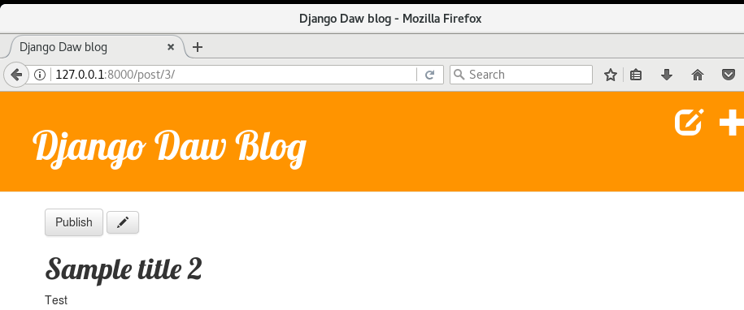
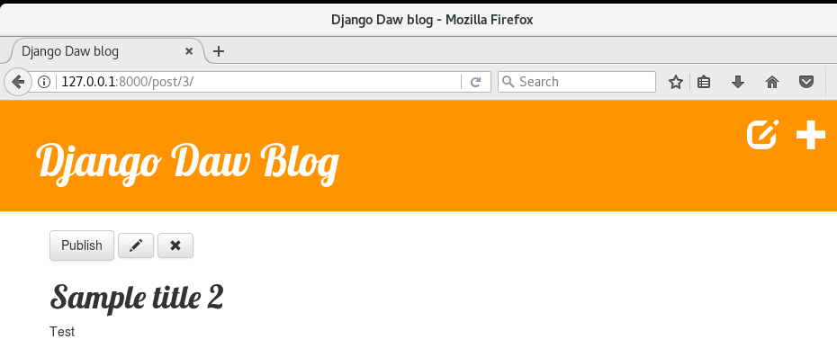

## Agregar mas a tu sitio web

Nuestro blog ha recorrido un gran camino hasta aquí, pero aún hay espacio para la mejora. Lo siguiente, vamos a agregar nuevas características para borradores y su publicación. También vamos a agregar eliminación de post que ya no queremos mas.

## Guarda nuevos post como borradores

Actualmente, nosotros creamos nuevos post usando nuestro formulario _New post_ y el post es publicado directamente. En lugar de publicar el post vamos a guardarlo como borrador, **elimina** esta línea en `blog/views.py` en los métodos `post_new` y `post_edit`:

```python
post.published_date = timezone.now()
```

De esta manera los nuevos post serán guardados como borradores y se podrán revisar después en vez de ser publicados instantáneamente. Todo lo que necesitamos es una manera de listar los borradores.

## Página con los post no publicados

El la práctica 12 vimos los _querysets_, posteriormente en la práctica 13 creamos una vista `post_list` que muestra solamente los post publicados (aquellos que tienen un `publication_date` no vacío).

Es tiempo de hacer algo similiar, pero con borradores.

Vamos a añadir un enlace en `blog/templates/blog/base.html` en el encabezado. No queremos mostrar nuestro borradores a todo el mundo, entonces vamos a colocarlo dentro de la verificación ``, justo después del botón de agregar posts.

```html
<a href="" class="top-menu"><span class="glyphicon glyphicon-edit"></span></a>
```

Ahora las URLs: en `blog/urls.py` vamos a agregar:

```python
path('drafts/', views.post_draft_list, name='post_draft_list'),
```

Tiempo de crear una nueva vista en `blog/views.py`:

```python
def post_draft_list(request):
    posts = Post.objects.filter(published_date__isnull=True).order_by('created_date')
    return render(request, 'blog/post_draft_list.html', {'posts': posts})
```

Esta línea `posts = Post.objects.filter(published_date__isnull=True).order_by('created_date')` se asegura de que solamente vamos a tomar post no publicados (`published_date__isnull=True`) y los ordena por `created_date` (`order_by('created_date')`).

Ok, el último paso es el template. Crea un archivo `blog/templates/blog/post_draft_list.html` y agrega lo siguiente:

```html
  
<div class="post">
    <p class="date">created: {{ post.created_date|date:'d-m-Y' }}</p>
    <h1><a href="">{{ post.title }}</a></h1>
    <p>{{ post.text|truncatechars:200 }}</p>
</div>
 
```

Se ve muy similar a nuestro `post_list.html`.

Ahora cuando vayas a `http://127.0.0.1:8000/drafts/` vas a ver la lista de post no publicados.

## Agrega un botón de publicación

Sería bueno tener un botón en el detalle del post que publique el post inmediatamente, para esto vamos a abrir `blog/templates/blog/post_detail.html` y cambiar estas líneas:

```html

<div class="date">{{ post.published_date }}</div>

```

por estas:

```html

<div class="date">{{ post.published_date }}</div>

<a class="btn btn-default" href="">Publish</a>

```

Como puedes ver, hemos agregado la línea ``. Esto significa, que la condición de `` no es cumplida (entonces no hay `published_date`), entonces queremos agregar la línea `<a class="btn btn-default" href="">Publish</a>`. Nota que estamos pasando la variable `pk` en el ``.

Tiempo de crear una URL (en `blog/urls.py`):

```python
path('post/<int:pk>/publish/$', views.post_publish, name='post_publish'),
```

Y finalmente una vista (como siempre, en `blog/views.py`):

```python
def post_publish(request, pk):
  post = get_object_or_404(Post, pk=pk)
  post.publish()
  return redirect('post_detail', pk=pk)
```

Recuerda, cuando creamos el modelo `Post` escribimos un método `publish`. Se veía como esto:

```python
def publish(self):
  self.published_date = timezone.now()
  self.save()
```

Ahora finalmente podemos usarlo. Y de nuevo al publicar el post, somos redirigidos inmediatamente a la página `post_detail`.



## Eliminar post

Vamos a abrir `blog/templates/blog/post_detail.html` de nuevo y vamos a añadir esta línea

```html
<a class="btn btn-default" href=""
    ><span class="glyphicon glyphicon-remove"></span
></a>
```

Justo debajo de la línea con el botón editar.

Ahora necesitamos una URL (`blog/urls.py`):

```python
path('post/<int:pk>/remove/$', views.post_remove, name='post_remove'),
```

Ahora, abre `blog/views.py` y agrega este código:

```python
def post_remove(request, pk):
  post = get_object_or_404(Post, pk=pk)
  post.delete()
  return redirect('post_list')
```

La única cosa nueva es en realidad, eliminar el post. Cada modelo en Django puede ser eliminado con `.delete()`.

Y en este momento, después de eliminar un post, queremos ir a la página web con la lista de posts, por eso usamos el `redirect`.

Probémoslo, ve a la página con los post e intentemos eliminarlo.



## Asegura tu sitio

Puedes haberte dado cuenta que no usaste tu contraseña, además de cuando iniciaste en la interfaz de administrador. También debes haber notado que esto significa que cualquiera puede editar tus post en tu blog. No se tu, pero a mi no me gustaría que cualquiera editara mi blog, así que vamos a hacer algo al respecto.

### Autorizando la edición y creación de post

Primero vamos a hacer las cosas seguras. Vamos a proteger nuestras vistas `post_new`, `post_edit`, `post_draft_list`, `post_remove` y `post_publish` para que solo usuarios que hayan ingresado puedan acceder a ellas. Django nos da algunas ayudas para hacer esto, llamados _decoradores_ (_decorators_). No te preocupes por las tecnicalidades ahora; puedes leer sobre eso después. El decorador que vamos a usar está en el módulo `django.contrib.auth.decorators` y es llamado `login_required`.

Entonces editemos `blog/views.py` y agrega estas líneas al comienzo del archivo junto con las demás importaciones:

```python
from django.contrib.auth.decorators import login_required
```

Entonces añade la línea antes de cada una de las vistas `post_new`, `post_edit`, `post_draft_list`, `post_remove` y `post_publish`, (decorándolas) como a continuación:

```python
@login_required
def post_new(request):
  [...]
```

Eso es todo. Ahora intenta acceder a `http://localhost:8000/post/new/`. ¿Notas la diferencia?

> Si obtienes un formulario vacío, posiblemente sigues logeado en la interfaz de administrador. Ve a `http://localhost:8000/admin/logout/` para salir, y luego `http://localhost:8000/post/new` de nuevo.

Puedes obtener uno de nuestros amados errores. Esto es muy interesante: El decorador que añadimos nos redireccionará a la página de ingreso, pero como no está disponible, retorna un "Page not found (404)".

No te olvides del decorador encima de `post_edit`, `post_remove`, `post_draft_list` y `post_publish` también.

Ahora otras personas no podrán crear post en nuestro blog. Desafortunadamente, nosotros tampoco podemos crearlos. Así que vamos a arreglarlo a continuación.

### Autenticando usuarios

Ahora podemos intentar hacer muchas cosas mágicas para implementar usuarios y contraseñas y autenticación, pero hacer esto correctamente es complicado. Como Django viene con "baterías incluidas", alguien ya ha hecho el trabajo duro por nosotros, así que vamos a utilizarlas.

En `mysite/urls.py` agrega una URL `path('accounts/login/', auth_views.LoginView.as_view(), name='login')`. Así el archivo debería verse similar a este:

```python
from django.urls import include, path
from django.contrib import admin

from django.contrib.auth import views as auth_views

urlpatterns = [
  path('admin/', admin.site.urls),
  path('accounts/login/', auth_views.LoginView.as_view(), name='login'),
  path('', include('blog.urls')),
]
```

Luego necesitamos agregar una plantilla para la página de ingreso, así que crearemos el directorio `blog/templates/registration` y dentro un archivo llamado `login.html`.

```html
  
<p>Your username and password didn't match. Please try again.</p>


<form method="post" action="">
    
    <table>
        <tr>
            <td>{{ form.username.label_tag }}</td>
            <td>{{ form.username }}</td>
        </tr>
        <tr>
            <td>{{ form.password.label_tag }}</td>
            <td>{{ form.password }}</td>
        </tr>
    </table>

    <input type="submit" value="login" />
    <input type="hidden" name="next" value="{{ next }}" />
</form>

```

Verás que también hace uso de la plantilla base para mantener el estilo de tu blog.

La cosa buena aquí es que funciona. No necesitamos lidiar con el manejo de formularios, las contraseñas y asegurarlas. Solamente una cosa mas para hacer. Entonces vamos a la configuración en `mysite/settings.py`:

```python
LOGIN_REDIRECT_URL = '/'
```

Entonces cuando se accede a la página directamente, la redireccionará a la página de primer nivel, el index (la página de inicio de blog).

## Mejorando el diseño

Ya definimos como autorizar usuarios. Vemos los botones para añadir post. Ahora queremos asegurarnos que el botón de ingreso le aparezca a todos.

Vamos a agregar el botón de ingreso así:

```html
<a href="" class="top-menu"><span class="glyphicon glyphicon-lock"></span></a>
```

Para esto necesitamos editar la plantilla, así que vamos a abrir `blog/templates/blog/base.html` y cambiarlo, así que la parte en medio de `<body>` se verá así:

```html
<body>
    <div class="page-header">
        
        <a href="" class="top-menu"><span class="glyphicon glyphicon-plus"></span></a>
        <a href="" class="top-menu"><span class="glyphicon glyphicon-edit"></span></a>
        
        <a href="" class="top-menu"><span class="glyphicon glyphicon-lock"></span></a>
        
        <h1><a href="/">DAW Blog</a></h1>
    </div>
    <div class="content container">
        <div class="row">
            <div class="col-md-8"> </div>
        </div>
    </div>
</body>
```

Debes reconocer el patrón aquí. Hay una condición _if_ en la plantilla que verifica si el usuario está autenticado para mostrar los botones de agregar y editar. De otra manera muestra el botón de ingreso.

## Más para usuarios autenticados

Vamos a agregarle un poco de azúcar a nuestras plantillas mientras estamos en esto. Primero vamos a mostrar algunos detalles de cuando ingresamos. Editemos el archivo `blog/templates/blog/base.html` así:

```html
<div class="page-header">
    
    <a href="" class="top-menu"><span class="glyphicon glyphicon-plus"></span></a>
    <a href="" class="top-menu"><span class="glyphicon glyphicon-edit"></span></a>
    <p class="top-menu">
        Hello {{ user.username }}
        <small>(<a href="">Log out</a>)</small>
    </p>
    
    <a href="" class="top-menu"><span class="glyphicon glyphicon-lock"></span></a>
    
    <h1><a href="/">DAW Blog</a></h1>
</div>
```

Esto agrega un mensaje "Hello _user.username_" para recordarle al usuario como ingresó, y que está autenticado. También agrega un enlace de salida del blog -- como puedes ver, aún no funciona.

Decidimos apoyarnos en Django para manejar el ingreso, así que vamos a dejar que Django se encargue de la salida. Mira [Using the Django authentication system](https://docs.djangoproject.com/en/2.1/topics/auth/default/) y ve si encuentras algo.

Ya que termines de leer. Vamos a pensar en agregar una URL en `mysite/urls.py` apuntando a la vista de salida (`django.contrib.auth.views.LogoutView`) así:

```python
from django.urls import include, path
from django.contrib import admin

from django.contrib.auth import views as auth_views

urlpatterns = [
  path('admin/', admin.site.urls),
  path('accounts/login/', auth_views.LoginView.as_view(), name='login'),
  path('accounts/logout/', auth_views.LogoutView.as_view(), name='logout', kwargs={'next_page': '/'}),
  path('', include('blog.urls')),
]
```

No olvides agregar la configuración de redirección después del logout en `mysite/settings.py`:

```python
LOGOUT_REDIRECT_URL = '/'
```

Si has seguido todo lo anterior, en este punto, tu blog ahora:

-   necesita un nombre de usuario y contraseña para ingresar,
-   necesita haber ingresado para agregar, editar, publicar o eliminar posts
-   puede salir de nuevo
