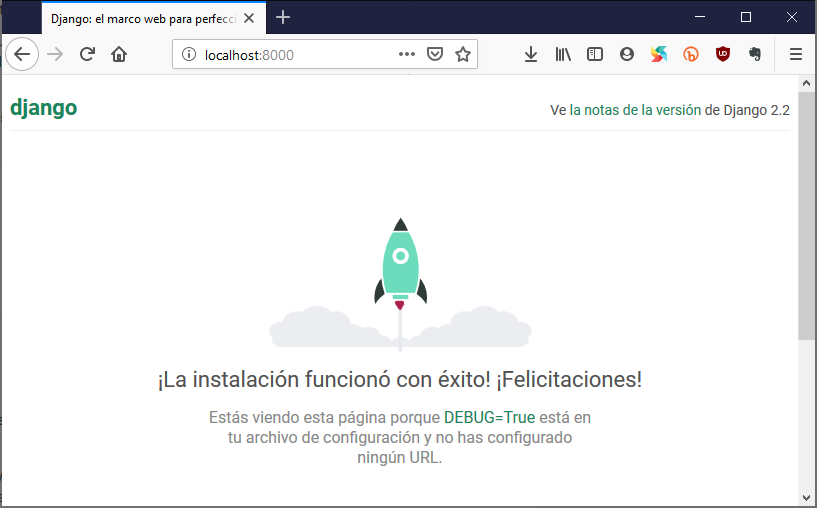

## Instalación de Django

### Entorno virtual

Antes de instalar Django, instalaremos una herramienta extremadamente útil que ayudará a mantener tu entorno de desarrollo ordenado en tu computadora. Podrías saltarte este paso en proyectos futuros, pero es altamente recomendable que lo hagas. Así que, vamos a crear un entorno virtual (también llamado un `virtualenv`). Este aislará la configuración Python/Django para cada proyecto, lo que significa que cualquier cambio que realices en una aplicación no afectará a otras que estés desarrollando en la misma máquina.

Todo lo que necesitas hacer es encontrar un directorio en el que desees crear el `virtualenv`; tu directorio `home` (el directorio designado a tu usuario), por ejemplo. Para está práctica usaremos un nuevo directorio `django-daw` en tu directorio `home`:




```sh
mkdir ~/django-daw
cd ~/django-daw
```




```bat
mkdir %userprofile%\django-daw
cd %userprofile%\django-daw
```




Haremos un `virtualenv` llamado `env`, así:




```sh
virtualenv env
```




Ahora bien, `env` es el nombre de tu `virtualenv`. Puedes usar cualquier otro nombre (`ambiente1`, `miambiente`, `myvenv`), pero mantén el uso de minúsculas y no incluyas espacios. También es una buena idea mantener el nombre corto.

Como resultado del comando anterior veras algo así.




```sh
$ virtualenv env
created virtual environment CPython3.9.0.final.0-64 in 688ms
  creator CPython3Windows(dest=C:\Users\carlos\django-daw\env, clear=False, global=False)
  seeder FromAppData(download=False, pip=bundle, setuptools=bundle, wheel=bundle, via=copy, app_data_dir=C:\Users\carlos\AppData\Local\pypa\virtualenv)
    added seed packages: pip==20.2.3, setuptools==50.3.0, wheel==0.35.1
  activators BashActivator,BatchActivator,FishActivator,PowerShellActivator,PythonActivator,XonshActivator
```




```bat
> virtualenv env
created virtual environment CPython3.9.0.final.0-64 in 6055ms
  creator CPython3Windows(dest=C:\Users\carlos\django\env, clear=False, global=False)
  seeder FromAppData(download=False, pip=bundle, setuptools=bundle, wheel=bundle, via=copy, app_data_dir=C:\Users\carlos\AppData\Local\pypa\virtualenv)
    added seed packages: pip==20.2.3, setuptools==50.3.0, wheel==0.35.1
  activators BashActivator,BatchActivator,FishActivator,PowerShellActivator,PythonActivator,XonshActivator
```




### Trabajar con `virtualenv`

Este comando anterior creará un directorio llamado `env` que contiene nuestro entorno virtual (básicamente un montón de archivos y carpetas). Todo lo que queremos hacer ahora es iniciarlo ejecutando:




```sh
source env/Scripts/activate
```




```bat
env\Scripts\activate
```




```sh
source env/bin/activate
```




Sabrás que tienes `virtualenv` iniciado cuando veas que aparece un prompt similar a este en la consola:




```sh
(env)
carlos@ubx-carlos MINGW64 ~/django-daw
$
```




```bat
(env) C:\Users\carlos\django-daw>
```




```sh
(env) carlos@ubx-carlos:~/django-daw$
```




{}
Cuando trabajes en un entorno virtual, Python automáticamente se referirá a la versión correcta, de modo que puedes utilizar `python` en vez de `python3`. Esto es porque al ser un entorno aislado la única versión "instalada" de Python es con la que se creó el entorno.
{}

{}
**Nota:** Recuerda estos dos comandos con los que vas al directorio base del proyecto y con el que se activa el entorno virtual, ya que los utilizaras siempre al inicio de las siguientes actividades.
{}

### Instalar Django

Ahora que tienes tu entorno virtual activo, puedes instalar Django. Para esto solo ejecuta el comando `python -m pip install django` para instalar la version más nueva de Django.




```sh
(env) $ python -m pip install django
Collecting django
  Using cached Django-3.1.2-py3-none-any.whl (7.8 MB)
Collecting asgiref~=3.2.10
  Using cached asgiref-3.2.10-py3-none-any.whl (19 kB)
Collecting sqlparse>=0.2.2
  Using cached sqlparse-0.4.1-py3-none-any.whl (42 kB)
Collecting pytz
  Using cached pytz-2020.1-py2.py3-none-any.whl (510 kB)
Installing collected packages: asgiref, sqlparse, pytz, django
Successfully installed asgiref-3.2.10 django-3.1.2 pytz-2020.1 sqlparse-0.4.1
```




```bat
(env) >python -m pip install django
Collecting django
  Using cached Django-3.1.2-py3-none-any.whl (7.8 MB)
Collecting sqlparse>=0.2.2
  Using cached sqlparse-0.4.1-py3-none-any.whl (42 kB)
Collecting pytz
  Using cached pytz-2020.1-py2.py3-none-any.whl (510 kB)
Collecting asgiref~=3.2.10
  Using cached asgiref-3.2.10-py3-none-any.whl (19 kB)
Installing collected packages: sqlparse, pytz, asgiref, django
Successfully installed asgiref-3.2.10 django-3.1.2 pytz-2020.1 sqlparse-0.4.1
```




Eso es todo. Ahora estás listo (por fin) para crear una aplicación con Django.

## Primer proyecto en Django

Vamos a crear un pequeño blog.

El primer paso para crearlo es iniciar un nuevo proyecto en Django. Básicamente, esto significa que podrás correr algunos scripts proporcionados por Django que crearán el boilerplate (la estructura y código base) de un proyecto para nosotros: un montón de directorios y archivos que vamos a utilizar más adelante.

Los nombres de algunos archivos y directorios son muy importantes para Django. No deberías renombrar los archivos que estamos a punto de crear. Moverlos a un lugar diferente tampoco es una buena idea. Django tiene que mantener una cierta estructura para ser capaz de encontrar cosas importantes.

{}
Recuerda ejecutar todos los comandos en tu entrono virtual. Si no ves un prefijo `(env)` en tu consola necesitas activar tu entorno. Expliqué cómo hacer eso en la sección [Trabajar con `virtualenv`](#trabajar_con_virtualenv).
{}

En tu consola debes ejecutar el siguiente comando. **No te olvides de añadir el punto `.` al final**:




```sh
django-admin startproject mysite .
```




{}
El punto `.` es crucial porque indica al script que instale Django en el directorio actual (para el cual el punto es una referencia corta).
{}

El comando `django-admin` creará los archivos y directorios para ti. Ahora deberías tener una estructura de directorios parecida a esto (en _Bash_ usa el comando `tree . -L 4 -I env`):




```sh
(env) $ tree . -L 4 -I env
.
|-- manage.py
`-- mysite
    |-- __init__.py
    |-- asgi.py
    |-- settings.py
    |-- urls.py
    `-- wsgi.py
```




El script `manage.py` ayuda con la administración del sitio. Con ello podremos iniciar un servidor web en nuestro ordenador sin necesidad de instalar nada más, entre otras cosas.

El archivo `settings.py` contiene la configuración de tu sitio web.

¿Recuerdas cuando hablamos de un cartero que debía comprobar donde entregar una carta? El archivo `urls.py` contiene una lista de los patrones utilizados por `urlresolver`.

Ignoremos los otros archivos por ahora - no los cambiaremos. Lo único que debes recordar es no borrarlos por accidente.

### Cambiando la configuración

Vamos a hacer algunos cambios en `mysite/settings.py`. Abre el archivo usando el editor de código de tu preferencia.

{}
**Tip**
\
Ten en cuenta que `settings.py` es un archivo normal, como cualquier otro. Puedes abrirlo desde dentro de un editor de texto usando la opción `File -> Open`. Esto debería de abrir la ya conocida ventana en la que puedes navegar e ir a seleccionar `settings.py` y abrirlo. De manera alternativa puedes abrir el archivo desde el explorador de archivos de tu sistema operativo. O la que más me gusta es desde la terminal (que ya tenemos abierta) con _Visual Studio Code_ usando el comando `code mysite/settings.py`.
{}

Para tener la hora local en nuestro sitio web. Ve a la lista de usos horarios de [Wikipedia](https://en.wikipedia.org/wiki/List_of_tz_database_time_zones) y copia tu zona horaria (TZ). Por ejemplo, `America/Tijuana`.

En `settings.py`, encuentra la línea que contiene `TIME_ZONE` y modifícala para elegir tu propia zona horaria, por ejemplo:

```python
TIME_ZONE = 'America/Tijuana'
```

Un código de idioma consiste en una abreviatura para un idioma, ej. `en` de Ingles o `de` para Aleman, y un código de país, ej. `de` para Alemania o `ch` para Suiza. Al cambiar el código de idioma por defecto hará que los botones y las notificaciones de Django estén en el idioma que elijas. Así tendrás un botón "Cancel" traducido al lenguaje que definas aquí. [Django tiene soporte para muchos idiomas](http://www.i18nguy.com/unicode/language-identifiers.html).

Cambia el código de lenguaje cambiando la siguiente línea en el archivo `settings.py`:

```python
LANGUAGE_CODE = 'es-MX'
```

También necesitaremos agregar una ruta para los archivos estáticos (aprenderemos sobre los archivos estáticos y CSS más tarde). Ve hacia abajo hasta el _final_ del archivo, y justo debajo de la entrada `STATIC_URL`, agrega lo correspondiente:

```python
STATIC_URL = '/static/'
MEDIA_URL = '/media/'
STATIC_ROOT = os.path.join(BASE_DIR, 'static')
MEDIA_ROOT = os.path.join(BASE_DIR, 'media')
```

Debido a que estamos utilizando el modulo `os` para que nos construya un path viable, debemos importar el modulo al inicio del archivo. Así:

```python
import os
```

Cuando `DEBUG` is `True` y `ALLOWED_HOSTS` esta en blanco, las direcciones con las que el sitio web funcionará será cualquiera de esta lista `['localhost', '127.0.0.1', '[::1]']`. Esto no hará juego con nuestro hostname en PythonAnywhere una vez que hagamos el despliegue de nuestra aplicación, así que cambiaremos la configuración a:

```python
ALLOWED_HOSTS = ['localhost', '127.0.0.1', '.pythonanywhere.com']
```

### Configurar una base de datos

Hay una gran variedad de opciones de bases de datos para almacenar la información de tu sitio. Utilizaremos el que viene por defecto, `sqlite3`.

Esto ya está configurado en esta parte de tu archivo `mysite/settings.py`:

```python
DATABASES = {
        'default': {
            'ENGINE': 'django.db.backends.sqlite3',
            'NAME': os.path.join(BASE_DIR, 'db.sqlite3'),
        }
    }
```

Para crear una base de datos para nuestro blog, ejecutamos el siguiente en la consola: `python manage.py migrate` (necesitamos estar en el directorio de `django-daw` que contiene el archivo `manage.py`). Si eso va bien, deberías ver algo así:

```bash
(env) $ python manage.py migrate
Operations to perform:
  Apply all migrations: admin, auth, contenttypes, sessions
Running migrations:
  Applying contenttypes.0001_initial... OK
  Applying auth.0001_initial... OK
  Applying admin.0001_initial... OK
  Applying admin.0002_logentry_remove_auto_add... OK
  Applying admin.0003_logentry_add_action_flag_choices... OK
  Applying contenttypes.0002_remove_content_type_name... OK
  Applying auth.0002_alter_permission_name_max_length... OK
  Applying auth.0003_alter_user_email_max_length... OK
  Applying auth.0004_alter_user_username_opts... OK
  Applying auth.0005_alter_user_last_login_null... OK
  Applying auth.0006_require_contenttypes_0002... OK
  Applying auth.0007_alter_validators_add_error_messages... OK
  Applying auth.0008_alter_user_username_max_length... OK
  Applying auth.0009_alter_user_last_name_max_length... OK
  Applying auth.0010_alter_group_name_max_length... OK
  Applying auth.0011_update_proxy_permissions... OK
  Applying auth.0012_alter_user_first_name_max_length... OK
  Applying sessions.0001_initial... OK
```

### Iniciar nuestro servidor web

Debes estar en el directorio que contiene el archivo `manage.py` (el directorio `django-daw`). En la consola, podemos iniciar el servidor web ejecutando `python manage.py runserver`:

```bash
(env) $ python manage.py runserver
```

Ahora todo lo que debes hacer es verificar que tu sitio esté corriendo - abre tu navegador (Firefox, Chrome, Safari, Internet Explorer o el que utilices) e ingresa la dirección `http://127.0.0.1:8000/`, se debe ver algo como esto:



Mientras el servidor web esta corriendo, no veras el prompt para escribir nuevos comandos. La terminal aceptara nuevo texto pero no ejecutara ningún comando. Esto es porque el servidor web corre continuamente para escuchar las peticiones entrantes.

> Vimos como funcionaban los servidores y el protocolo HTTP en la unidad uno.

Para escribir más comandos o abres una nueva terminal (y no te olvides de activar tu entorno virtual allí también), o termina el servidor web yendo a la consola en la que está corriendo y presionando `Ctrl+C` - las teclas _Control_ y _C_ juntas.

Has creado tu primera aplicación web y la has ejecutado usando un servidor web.
