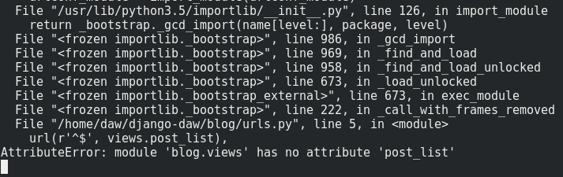

Vamos a construir nuestra primera página web -- una página de inicio para nuestro blog. Pero primero, vamos a aprender un poco sobre URLs en Django.

## URLs

Una URL, en este caso particular, es simplemente una dirección web. Puedes ver una URL cada vez que visitas cualquier sitio web - es visible en la barra de direcciones de tu navegador (Sí, `http://127.0.0.1:8000` es una URL. Y `http://uabc.mx` es también una URL).


Cada página en Internet necesita su propia URL. De esta manera tu aplicación sabe lo que debe mostrar a un usuario que abre una URL. En Django se usa algo llamado `urlpatterns` (patrones de URL), un conjunto de patrones que Django intentará hacer coincidir con la dirección URL recibida para encontrar la vista correcta.

### Funcionamiento

Vamos a abrir el archivo `mysite/urls.py` en tu editor de texto de preferencia (code, vim, nano, sublime) y ver cómo es:

```python
"""mysite URL Configuration

[...]
"""
from django.contrib import admin
from django.urls import path

urlpatterns = [
    path('admin/', admin.site.urls),
]
```

Como puedes ver, Django ya puso algo aquí para nosotros.

Las líneas que comienzan con triples comillas (`'''` o `"""`) se les llama _docstrings_ -- puedes escribirlas al inicio de un script, clase o método para describir que hace. Estas líneas no se ejecutaran en Python.

La URL de admin, que se visitó en una sección anterior, ya está aquí:

```python
path('admin/', admin.site.urls),
```

Esto significa que para cada URL que empieza con `admin/` Django encontrará su correspondiente _view_. En este caso estamos incluyendo en una sola línea muchas URLs de admin, así no está todo amontonado en este pequeño archivo - es más limpio y legible.

### Tu primer URL de Django

Es hora de crear nuestro primer URL. Queremos que '<http://127.0.0.1:8000/>' sea la página de inicio de nuestro blog y que muestre una lista de posts.

También queremos mantener el archivo `mysite/urls.py` limpio, así que importaremos URLs de nuestro `blog` al archivo principal `mysite/urls.py`.

Agrega una línea que importará `blog.urls`. Nota que estamos usamos la función aquí `include` **así que deberás** agregar eso a la primera línea de import en el script.

Tu archivo `mysite/urls.py` debería verse algo así:

```python
from django.contrib import admin
from django.urls import path, include

urlpatterns = [
    path('admin/', admin.site.urls),
    path('', include('blog.urls')),
]
```

Django ahora redirigirá todo lo que vaya hacia '<http://127.0.0.1:8000/>' a `blog.urls` y buscará por más instrucciones allí.

### blog.urls

Crea un nuevo archivo vacío `blog/urls.py`. Agrega estas primeras dos líneas:

```python
from django.urls import path
from . import views
```

Aquí solo estamos importando la función `path` de Django y todas nuestras `views` de la aplicación `blog` (todavía no tenemos ninguna, pero lo haremos en un momento).

Luego de esto, podemos agregar nuestro primer patrón URL:

```python
urlpatterns = [
    path('', views.post_list, name='post_list'),
]
```

Como puedes ver, ahora estamos asignando una `view` llamada `post_list` al patron de URL que es una cadena vacía. Esta expresión regular hará juego con cualquier una cadena vacía que venga en el request HTTP. Y esto es correcto, ya que en los URL resolvers de Django '<http://127.0.0.1:8000/>' no es parte del URL. Este patrón hará que Django sepa qué `views.post_list` es el controlador correcto que ejecutar si alguien ingresa a tu sitio web con la dirección '<http://127.0.0.1:8000/>'.

La ultima parte, `name='post_list'`, es el nombre de la URL que se usara para identificar la vista. Este puede ser igual al nombre de la vista o puede ser algo completamente diferente. Nosotros estaremos usando los nombres de las URLs más adelante en el proyecto, así que es importante nombrar cada URL en la aplicación. También debemos de mantener los nombres de las URLs únicos y fáciles de recordar.

Si intentas visitar <http://127.0.0.1:8000/> en este momento, encontrarás un mensaje del tipo `web page not available`. Esto es porque el servidor (recordaste ejecutar `runserver` ?) no esta corriendo. Hecha un vistazo a la ventana de tu servidor para ver el porque.



Tu consola muestra un error, pero no es para preocuparse - es de hecho muy util. En este caso esta diciendo que el modulo `blog.views` no tiene un atributo (metodo) llamado **`post_list`**. Ese es el nombre de la _vista_ que Django está tratando de encontrar y usar, pero no la hemos creado todavía. En este punto tu `/admin/` tampoco funcionará. No pasa nada, esto lo solucionaremos en la siguiente parte.

{}
**Tip**
\
Si deseas saber mas sobre patrones de URL en Django, date una vuielta por la [documentación oficial](https://docs.djangoproject.com/en/3.1/topics/http/urls/).
{}

## Vistas de Django (controladores)

Es hora de deshacerse del error que hemos creado en la parte anterior.

Un `view` es un lugar donde ponemos la "lógica" de nuestra aplicación, es decir es un controlador de acuerdo al patron de diseño MVC (recuerda que Django usa MTV). Este `view` solicitará información al `model` que creaste anteriormente (Post), esta información se procesará para ser incluida en un `template` que crearás en una sección mas adelante. Las vistas son sólo funciones de Python, que son un poco más complicadas que lo que hicimos en la práctica Introducción a Python.

Las vistas se colocan en el archivo `views.py`. Agregaremos nuestras vistas al archivo `blog/views.py`.

### blog.views

Bien, vamos abrir este archivo `blog/views.py` y ver lo que contiene:

```python
from django.shortcuts import render

## Create your views here.
```

No demasiadas cosas aquí todavía.

Recuerda que las líneas que comienzan con `#` son comentarios - esto significa que esas líneas no serán ejecutadas por Python.

La vista más simple puede ser algo como esto, agregala al archivo.

```python
def post_list(request):
    return render(request, 'blog/post_list.html', {})
```

Como puedes ver, hemos creado un método (`def`) llamado `post_list` que toma un `request` y hace un `return` de un método `render` que generará nuestra página HTML a partir de una plantilla `blog/post_list.html`.

Guarda el archivo, dirígete a <http://127.0.0.1:8000/> y veamos lo que tenemos ahora.

¡Otro error! Leamos lo que está pasando ahora:


Esto indica que el servidor esta corriendo de nuevo, al menos, pero todavía no se ve bien. Esta es una pagina de error creada por el servidor, nada de que asustarnos - justo como los errores en la consola estos de hecho nos pueden ser muy útiles. Puedes leer que el `TemplateDoesNotExist`.

## Tu primera plantilla

Te estarás preguntando, ¿Qué es una plantilla?. Una plantilla es un archivo que podemos reutilizar para presentar información diferente de forma consistente -- por ejemplo, se podría utilizar una plantilla para ayudarte a escribir una carta, porque aunque cada carta puede contener un mensaje distinto y dirigirse a una persona diferente, compartirán el mismo formato.

El formato de una plantilla de Django se describe en HTML y algunas etiquetas especiales de Django para interpretar variables. Crear una plantilla significa crear un archivo de plantilla. Todo es un archivo, probablemente hayas notado esto ya.

Las plantillas se guardan en el directorio de `blog/templates/blog`. Así que primero crea un directorio llamado `templates` dentro del directorio de tu aplicación _blog_. Luego crea otro directorio llamado `blog` dentro de tu directorio de templates:

```text
blog
└───templates
    └───blog
```

(Tal vez te preguntes por qué necesitamos dos directorios llamados `blog` -- como descubrirás más adelante, esto es simplemente una útil convención de nomenclatura que hace la vida más fácil cuando las cosas empiezan a complicarse.)

Y ahora crea un archivo `post_list.html` (déjalo en blanco por ahora) dentro de la carpeta `blog/templates/blog`.

Mira cómo se ve su sitio web ahora: [http://localhost:8000/](http://localhost:8000/)

{}
Si todavía tienes un error `TemplateDoesNotExists`, intenta reiniciar el servidor. Ve a la línea de comandos, detén el servidor pulsando Ctrl + C (teclas Control y C juntas) y comienza de nuevo mediante la ejecución del comando `python manage.py runserver`.
{}


Ningún error. Sin embargo, por ahora, tu sitio web no está publicando nada excepto una página en blanco, porque la plantilla también está vacía. Tenemos que arreglarlo.

Añade lo siguiente a tu archivo de plantilla:

```html
<html>
    <body>
        <p>Hi there!</p>
        <p>It works!</p>
    </body>
</html>
```

¿Cómo luce ahora tu sitio web? Haz click para ver: [http://localhost:8000/](http://localhost:8000/)


Funcionó.

-   La etiqueta más básica, `<html>`, es siempre el principio de cualquier página web y `</html>` es siempre el final. Como puedes ver, todo el contenido de la página web va desde el principio de la etiqueta `<html>` y hasta la etiqueta de cierre `</html>`
-   `<p>` es una etiqueta para los elementos de párrafo; `</p>` cierra cada párrafo

### Encabezado y cuerpo

Cada página HTML también se divide en dos elementos: **head** y **body**.

-   **head** es un elemento que contiene información sobre el documento que no se muestra en la pantalla.
-   **body** es un elemento que contiene todo lo que se muestra como parte de la página web. Usamos para decirle al navegador acerca de la configuración de la página y para decir lo que realmente está en la página.

Por ejemplo, puedes ponerle un título a la página web dentro de la `<head>`, así:

```html
<html>
    <head>
        <title>DAW's blog</title>
    </head>
    <body>
        <p>Hi there!</p>
        <p>It works!</p>
    </body>
</html>
```

Guarda el archivo y actualiza tu página.


¿Observas cómo el navegador ha comprendido que "DAW's blog" es el título de tu página? Ha interpretado `<title>DAW's blog</title>` y colocó el texto en la barra de título de tu navegador (también se utilizará para marcadores y así sucesivamente).

Probablemente también hayas notado que cada etiqueta de apertura coincide con una _etiqueta de cierre_, con un `/`, y que los elementos son _anidados_ (es decir, no puedes cerrar una etiqueta particular hasta que todos los que estaban en su interior se hayan cerrado también).

Es como poner cosas en cajas. Tienes una caja grande, `<html></html>`; en su interior hay `<body></body>`, y que contiene las cajas aún más pequeñas: `<p></p>`.

Tienes que seguir estas reglas de etiquetas de _cierre_ y de _anidación_ de elementos -- si no lo haces, el navegador puede no ser capaz de interpretarlos correctamente y tu página se mostrará de manera incorrecta.

### Personaliza tu plantilla

Ahora, puedes divertirte un poco y tratar de personalizar tu plantilla. Aquí hay algunas etiquetas útiles para eso:

-   `<h1>Un título</h1>` para tu título más importante
-   `<h2>Un subtítulo</h2>` para el título del siguiente nivel
-   `<h3>Un subsubtítulo</h3>` ... y así hasta `<h6>`
-   `<em>texto</em>` pone en cursiva tu texto
-   `<strong>texto</strong>` pone en negrita tu texto
-   `<br />` un salto de línea (no puedes colocar nada dentro de br)
-   `<a href="https://localhost:8000">link</a>` crea un vínculo
-   `<ul><li>primer elemento</li><li>segundo elemento</li></ul>` crea una lista, ¡igual que esta!
-   `<div></div>` define una sección de la página

Aquí hay un ejemplo de una plantilla completa, copia y pega en `blog/templates/blog/post_list.html`:

```html
<html>
    <head>
        <title>Django DAW blog</title>
    </head>
    <body>
        <div>
            <h1><a href="">Django DAW Blog</a></h1>
        </div>

        <div>
            <p>published: 21.05.2017, 08:58</p>
            <h2><a href="">My first post</a></h2>
            <p>
                Aenean eu leo quam. Pellentesque ornare sem lacinia quam venenatis vestibulum. Donec id elit non mi
                porta gravida at eget metus. Fusce dapibus, tellus ac cursus commodo, tortor mauris condimentum nibh, ut
                fermentum massa justo sit amet risus.
            </p>
        </div>

        <div>
            <p>published: 21.05.2017, 08:59</p>
            <h2><a href="">My second post</a></h2>
            <p>
                Aenean eu leo quam. Pellentesque ornare sem lacinia quam venenatis vestibulum. Donec id elit non mi
                porta gravida at eget metus. Fusce dapibus, tellus ac cursus commodo, tortor mauris condimentum nibh, ut
                f.
            </p>
        </div>
    </body>
</html>
```

Aquí hemos creado tres secciones `div`.

-   El primer elemento `div` contiene el título de nuestro blog -- es un encabezado y un enlace
-   Otros dos elementos `div` contienen nuestros blogposts con la fecha de publicación, `h2` con un título que es clickeable y dos `p` (párrafo) de texto, uno para la fecha y uno para nuestro blogpost.

Nos da este efecto:


Pero hasta el momento, nuestra plantilla sólo muestra exactamente la **misma** información -- considerando que antes hablábamos de plantillas que nos permitían mostrar información **diferente** con el **mismo formato**.

Lo que queremos realmente es mostrar posts tomados de la base de datos que hayamos añadido con el administración de Django - pero esto lo dejamos para la sección donde veamos vistas por completo.

## Despliega tu aplicación

Sería bueno ver todo esto disponible en Internet. Hagamos otro despliegue en PythonAnywhere.

### Haz un commit y sube tu código al repositorio remoto

En primer lugar, veamos qué archivos han cambiado desde que hicimos el despliegue por última vez (corre estos comando de manera local, no en PythonAnywhere):

```bash
git status
```

Asegúrate de que estás en el directorio `django-daw` y vamos a decirle a `git` que incluya todos los cambios dentro de este directorio:

```bash
git add .
```

{}
`--all` significa que `git` también reconocerá si has eliminado archivos (por defecto, sólo reconoce archivos nuevos/modificados). También recuerda (de la práctica 3) qué `.` significa el directorio actual.
{}

Antes de que subamos todos los archivos, vamos a ver qué es lo que `git` subirá (todos los archivos que `git` cargará deberían aparecer en verde):

```bash
git status
```

Ya casi acabamos, ahora es tiempo de decirle que guarde este cambio en su historial. Vamos a darle un "mensaje de commit" donde describimos lo que hemos cambiado. Puedes escribir cualquier cosa que te gustaría en esta etapa, pero es útil escribir algo descriptivo para que puedas recordar lo que has hecho en el futuro.

```bash
git commit -m "Cambie el HTML para el sitio."
```

{}
Asegúrate de usar comillas dobles alrededor del mensaje de commit.
{}

Una vez que hicimos esto, subimos (push) nuestros cambios al repositorio remoto:

```bash
git push
```

### Descarga tu nuevo código a PythonAnywhere y actualiza tu aplicación web

-   Abre la página de [consolas de PythonAnywhere](https://www.pythonanywhere.com/login/?next=/consoles/) y ve a tu consola Bash (o comienza una nueva). Luego, ejecuta:

```bash
cd ~/gallegosj89.pythonanywhere.com
git pull
```

Y mira cómo tu código se descarga. Si quieres comprobar que ya ha terminado, puedes ir a la pestaña **Files** y ver tu código en PythonAnywhere.

-   Finalmente, dirígete a la [pestaña Web](https://www.pythonanywhere.com/login/?next=/web_app_setup/) y selecciona **Reload** en tu aplicación web.

Tu actualización debería estar en línea. Actualiza tu sitio web en el navegador. Ahora deberías poder ver tus cambios.

{}
**Tip**
\
Aprende más acerca de las plantillas (templates) de Django en la [documentación oficial](https://docs.djangoproject.com/en/3.1/topics/templates/)
{}
