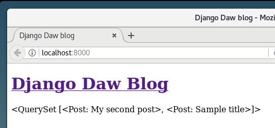
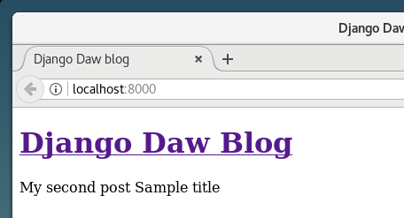
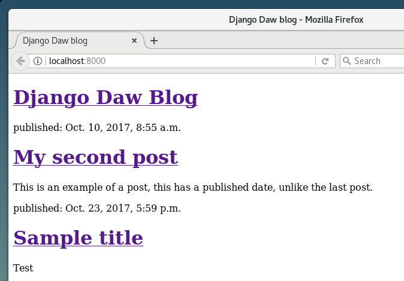

En esta sección aprenderás cómo Django se conecta a la base de datos, almacena los datos en ella, y más importante como los recupera.

## QuerySets

Un QuerySet es, en esencia, una lista de objetos de un modelo determinado. Un QuerySet te permite leer los datos de una base de datos, filtrarlos y ordenarlos. Es similar a lo que sería un _query_ en SQL pero en un lenguaje especifico de django.

### Django shell

Abre la consola local y despues de entrar al folder de tu proyecto e iniciar el entorno virtual, ejecuta este comando.

```bash
python manage.py shell
```

{}
Recuerda entrar al directorio de tu proyecto, puedes llegar allí con `cd ~/django-daw` o `cd %userprofile%\django-daw`. Despues inicia el entorno virtual `source env/Scripts/activate`.
{}

El resultado debería ser:

```python
(InteractiveConsole)
>>>
```

Ahora estás en la consola interactiva de Django. Es como la consola de Python, pero con un toque de magia Django. Puedes utilizar todos los comandos Python aquí también, por supuesto.

### Leer todas las entradas de una tabla

Primero vamos a mostrar todos nuestros posts. Puedes hacerlo con el siguiente comando:

```python
>>> Post.objects.all()
Traceback (most recent call last):
        File "<console>", line 1, in <module>
NameError: name 'Post' is not defined
```

Apareció un error! Nos dice que no hay ningún objeto Post. Esto es correcto, hizo falta que primero importáramos la clase. Debido a que el interprete funciona como estar introduciendo linea pr linea de un script de python, debemos importar los módulos que necesitamos.

```python
>>> from blog.models import Post
```

Esto es simple: importamos la clase `Post` de `blog.models`. Vamos a intentar mostrar todos los posts nuevamente:

```python
>>> Post.objects.all()
<QuerySet [<Post: mi titulo>, <Post: otro titulo de post>]>
```

Esta es una lista de los posts creados anteriormente. Hemos creado estos posts usando la interfaz del administrador de Django. Sin embargo, ahora queremos crear nuevos posts usando este interprete de Django, veamos como se hace.

### Crea un objeto

Esta es la forma de crear un nuevo objeto Post en la base de datos:

```python
>>> Post.objects.create(author=me, title='Titulo de ejemplo', text='Prueba')
```

Pero hay un ingrediente faltante: `me`. Necesitamos pasar una instancia de la clase `User` como autor. Esto se logra importando la clase desde los modelos de autenticación de Django, así:

```python
    >>> from django.contrib.auth.models import User
```

Veamos que usuarios tenemos en nuestra base de datos, prueba esto:

```python
>>> User.objects.all()
<QuerySet [<User: carlos>]>
```

Este es el super usuario que creamos anteriormente, vamos a obtener una instancia de ese usuario ahora:

```python
me = User.objects.get(username='carlos')
```

Como puedes ver, hicimos un `get` de un `User` con el `username` que sea igual a `'carlos'`. Acuérdate de poner tu nombre de usuario para obtener tu usuario. Ahora finalmente podemos crear nuestro primer post:

```python
>>> Post.objects.create(author=me, title='Titulo de ejemplo', text='Prueba')
```

Probemos si funcionó.

```python
>>> Post.objects.all()
<QuerySet [<Post: mi titulo>, <Post: otro titulo de post>, <Post: Titulo de ejemplo>]>
```

En este punto deberías de haber visto un nuevo post en la lista.

### Agrega más posts

Ahora puedes divertirte un poco y añadir más posts para ver cómo funciona. Añade 2 ó 3 más y avanza a la siguiente parte.

### Filtrado de objetos

Una parte importante de los QuerySets es la habilidad para filtrarlos. Digamos que queremos encontrar todos los posts cuyo autor es el User `'carlos'`. Usaremos `filter` en vez de `all` en `Post.objects.all()`. En los paréntesis estableceremos qué condición(es) deben cumplirse por un post del blog para terminar en nuestro queryset. En nuestro caso sería `author` es igual a `me`. La forma de escribirlo en Django es: `author=me`. Ahora nuestro bloque de código se ve como esto:

```python
>>> Post.objects.filter(author=me)
<QuerySet [<Post: Post numero 1>, <Post: Post numero 2>, <Post: Post numero 3>, <Post: Titulo del post numero 4>]>
```

¿O tal vez querramos ver todos los posts que contengan la palabra 'titulo' en el campo `title`?

```python
>>> Post.objects.filter(title__contains='title')
<QuerySet [<Post: Titulo dle post numero 4>]>
```

{}
Hay dos guiones bajos (`_`) entre `title` y `contains`. Django ORM utiliza esta sintaxis para separar los nombres de los campos ("title") y operaciones o filtros ("contains"). Si sólo utilizas un guión bajo, obtendrás un error como "FieldError: Cannot resolve keyword title_contains".
{}

También puedes obtener una lista de todos los posts publicados. Lo hacemos filtrando los posts que tienen el campo `published_date` en el pasado:

```python
>>> from django.utils import timezone
>>> Post.objects.filter(published_date__lte=timezone.now())
[]
```

Desafortunadamente, ninguno de nuestros posts han sido publicados todavía. Vamos a cambiar esto, primero obtén una instancia de un post que queramos publicar:

```python
>>> post = Post.objects.get(title="Titulo de ejemplo")
```

Luego utiliza el método `publish` para publicarlo.

```python
>>> post.publish()
```

Ahora intenta obtener la lista de posts publicados nuevamente (presiona la tecla con la flecha hacia arriba 3 veces y presiona `Enter`):

```python
>>> Post.objects.filter(published_date__lte=timezone.now())
<QuerySet [<Post: Titulo de ejemplo>]>
```

### Ordenando objetos

Los QuerySets también te permiten ordenar la lista de objetos. Intentemos ordenarlos por el campo `created_date`:

```python
>>> Post.objects.order_by('created_date')
<QuerySet [<Post: Post numero 1>, <Post: Post numero 2>, <Post: Post numero 3>, <Post: Titulo del post numero 4>]>
```

También podemos invertir el ordenamiento agregando `-` al principio:

```python
>>> Post.objects.order_by('-created_date')
<QuerySet [<Post: Titulo del post numero 4>, <Post: Post numero 3>, <Post: Post numero 2>, <Post: Post numero 1>]>
```

### Encadenando QuerySets

También puedes combinar QuerySets al **encadenarlos** juntos:

```python
>>> Post.objects.filter(published_date__lte=timezone.now()).order_by('published_date')
```

Esto es muy poderoso y te permite crear búsquedas complejas.

Para cerrar la consola, escribe:

```python
>>> exit()
$
```

## Datos dinámicos en las plantillas

Tenemos diferentes piezas en su lugar: el modelo `Post` está definido en `models.py`, tenemos a `post_list` en `views.py` y la plantilla agregada. Pero, nos falta cómo hacer que realmente aparezcan nuestros posts en nuestra plantilla HTML, eso es lo que haremos: tomar algún contenido (modelos guardados en la base de datos) y mostrarlo adecuadamente en nuestra plantilla.

Esto es exactamente lo que las _views_ se supone que hacen: conectar modelos con plantillas. En nuestra _view_ `post_list` necesitaremos tomar los modelos que deseamos mostrar y pasarlos a una plantilla. Así que básicamente en una _view_ decidimos qué (modelo) se mostrará en una plantilla.

Necesitamos abrir nuestro archivo `blog/views.py`. Hasta ahora la _view_ `post_list` se ve así:

```python
from django.shortcuts import render

def post_list(request):
    return render(request, 'blog/post_list.html', {})
```

Recuerdas cuando hablamos de incluir código de diferentes archivos. Ahora tenemos que incluir la clase del modelo que definimos en el archivo `models.py`. Agregaremos la línea `from .models import Post` de la siguiente forma:

```python
from django.shortcuts import render
from .models import Post
```

El punto antes de `models` indica el _directorio actual_ o la _aplicación actual_. Como `views.py` y `models.py` están en el mismo directorio, simplemente usamos `.` y el nombre del archivo (sin `.py`). Ahora importamos el nombre del modelo (`Post`).

Para tomar publicaciones reales del modelo `Post`, necesitamos los `QuerySet` (conjunto de consultas) que acabamos de ver.

### QuerySet

Ya debes estar familiarizado con la forma en que funcionan los QuerySets.

Entonces ahora nos interesa obtener una lista de entradas del blog que han sido publicadas y ordenadas por `published_date` (fecha de publicación), ya hicimos eso en el la práctica anterior.

```python
Post.objects.filter(published_date__lte=timezone.now()).order_by('published_date')
```

Ahora pondremos este bloque de código en el archivo `blog/views.py`, agregándole a la función `def post_list(request)`, pero no olvides primero agregar la libreria de timezone `from django.utils import timezone`:

```python
from django.shortcuts import render
from django.utils import timezone
from .models import Post

def post_list(request):
    posts = Post.objects.filter(published_date__lte=timezone.now()).order_by('published_date')
    return render(request, 'blog/post_list.html', {})
```

La última parte es pasar el QuerySet `posts` al template. Observa que creamos una _variable_ para nuestro QuerySet: `posts`. Tómala como el nombre de nuestro QuerySet. De aquí en adelante vamos a referirnos al QuerySet con ese nombre.

En la función `render` ya tenemos el parámetro `request` (todo lo que recibimos del usuario vía Internet) y el archivo `'blog/post_list.html'` como plantilla. El último parámetro, `{}`, es un campo en el que podemos agregar algunas cosas para que la plantilla las use. Necesitamos nombrarlos (los seguiremos llamando `'posts'` por ahora). Se debería ver así: `{'posts': posts}`. Observa que la parte que va antes de `:` es una cadena; necesitas ponerlo entre comillas: `''`.

Finalmente nuestro archivo `blog/views.py` debería verse así:

```python
from django.shortcuts import render
from django.utils import timezone
from .models import Post

def post_list(request):
    posts = Post.objects.filter(published_date__lte=timezone.now()).order_by('published_date')
    return render(request, 'blog/post_list.html', {'posts': posts})
```

Ahora regresemos a nuestra plantilla y mostremos este QuerySet.

{}
Si quieres leer un poco más acerca de [QuerySets](https://docs.djangoproject.com/en/3.1/ref/models/querysets/) visitando la documentación de Django.
{}

### Plantillas de Django

Hora de mostrar algunos datos. Django nos provee las útiles **template tags** para ello.

#### Template tags

Verás, en HTML no puedes realmente poner código Python, porque los navegadores no lo entienden. Ellos sólo saben HTML. Sabemos que HTML es algo estático, mientras que Python es mucho más dinámico.

**Django template tags** nos permite transferir cosas de Python a HTML, de esta manera puedes construir sitios web dinámicos más rápido.

#### Mostrar la plantilla `post_list`

En la parte anterior dimos a nuestra plantilla una lista de posts en la variable `posts`. Ahora lo mostraremos en HTML.

Para imprimir una variable en una plantilla de Django, utilizamos llaves dobles con el nombre de la variable dentro, así:

```html
{{ posts }}
```

Prueba esto en tu plantilla `blog/templates/blog/post_list.html`. Reemplaza todo desde el segundo `<div>` hasta el tercer`</div>` con `{{ posts }}`, guarda el archivo y actualiza la página para ver los resultados:



Como puedes ver, todo lo que obtenemos es esto:

```python
<QuerySet [<Post: Mi segundo post>, <Post: Mi primer post>]>
```

Esto significa que Django lo entiende como una lista de objetos. Recuerda de la práctica de **Introducción a Python** que podemos mostrar listas con bucles. En una plantilla de Django, lo haces de esta manera:

```html
 {{ post }} 
```

Prueba esto en tu plantilla.



Funciona. Pero queremos que se muestren cómo los posts estáticos que creamos anteriormente en la práctica de **Introducción a HTML**. Puedes mezclar HTML y template tags. Nuestro body se verá así:

```html
<div>
    <h1><a href="/">Django DAW Blog</a></h1>
</div>


<div>
    <p>published: {{ post.published_date }}</p>
    <h1><a href="">{{ post.title }}</a></h1>
    <p>{{ post.text|linebreaksbr }}</p>
</div>

```

Todo lo que pones entre `` y `` se repetirá para cada objeto en la lista. Actualiza tu página:



¿Has notado que utilizamos una notación diferente esta vez `{{ post.title }}` ó `{{ post.text }}`? Estamos accediendo a datos en cada uno de los campos definidos en nuestro modelo `Post`. Además, el `|linebreaksbr` está dirigiendo el texto de los posts a través de un filtro para convertir saltos de línea en párrafos.

## Una cosa más

Sería bueno ver si tu sitio web seguirá funcionando en la Internet pública, intentemos desplegándolo en PythonAnywhere nuevamente. Aquí te esta una recapitulación para ayudarte...

-   Primero, sube tu código a GitHub

```bash
$ pwd
C:/Users/carlos/django-daw
$ git status
[...]
$ git add .
$ git status
[...]
$ git commit -m "Modificacion a las vistas y plantillas para mostrar posts de la base de datos."
[...]
$ git push
```

-   Luego, identifícate en [PythonAnywhere](https://www.pythonanywhere.com/consoles/) y ve a tu **consola Bash** (o empieza una nueva), y ejecuta:

```bash
$ cd ~/subdomain.pythonanywhere.com
$ git pull
[...]
```

(No olvides sustituir <subdomain.pythonanywhere.com> con tu subdominio de PythonAnywhere sin los parentesis angulares.)

-   Finalmente, ve a la [pestaña Web](https://www.pythonanywhere.com/web_app_setup/) y presiona **Reload** en tu aplicación web. Tu actualización debería de estar en vivo en <http://subdomain.pythonanywhere.com> -- revisalo en tu navegador. Si los posts en tu blog no concuerdan con los posts que tienes en tu servidor local, eso estabien. Las bases de datos en tu computadora y en PythonAnywhere no se sincronizan como el resto de archivos debido a que lo agregamos al `.gitignore`, archivo con el que le decimos a Git que ignorar.

Ahora sigue adelante, trata de agregar un nuevo post usando el panel de administrador de Django (¡recuerda añadir published_date!) y luego actualiza tu página para ver si aparece tu nuevo post.
