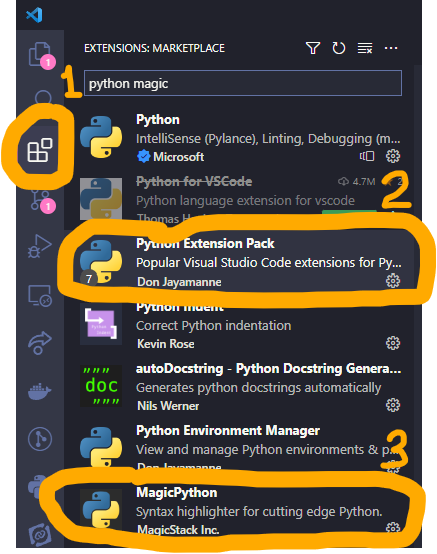
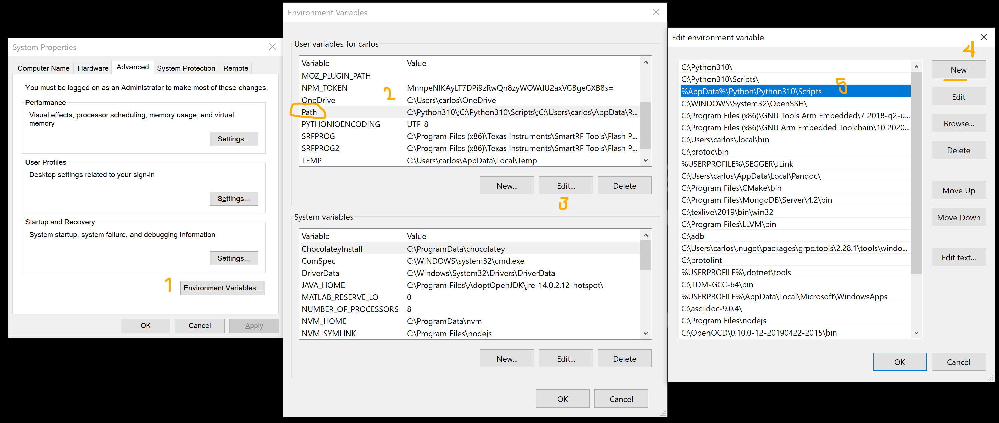
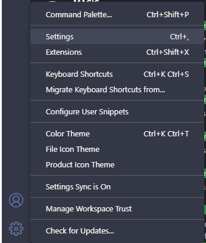
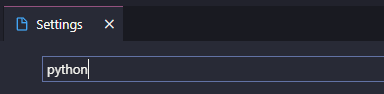
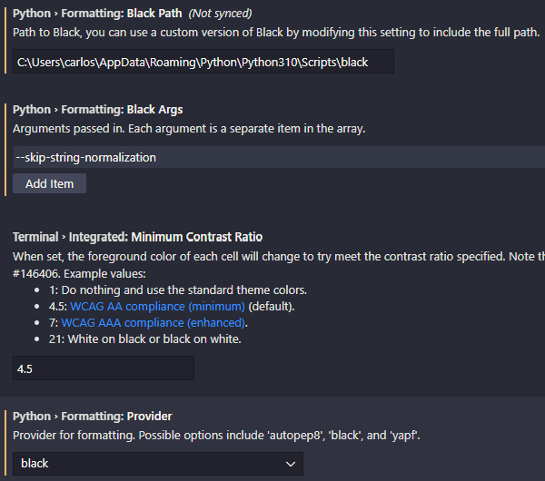
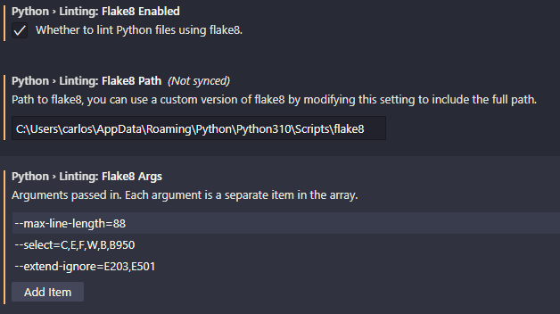

{}Python **v3.7** es el mínimo requerido para este tutorial{}

{}La última versión de **Django** es la recomendada, las pruebas son hechas siempre con la última versión.{}

Las indicaciones siguientes te ayudarán a configurar tu ambiente de desarrollo. Si nunca haz trabajado con Python, te sugiero enormemente que busques un curso o tutorial, aquí tienes es [videotutorial de Python para principiantes](https://www.youtube.com/watch?v=chPhlsHoEPo&list=PLL0TiOXBeDah92BouG1YTuej0eJj6o5Sl&index=3) como recomendación.

<!--more-->

## Requisitos

La siguiente es una lista de los requisitos necesarios para trabajar en un correcto ambiente de trabajo para Python y Django. Descarga la version correspondiente con tu sistema operativo (32 o 64 bits).

En caso de que utilices algún software de restauración de sistema (e.j. Deep Freeze), instala estas herramientas con el software deshabilitado. Toma en cuenta que al utilizar un software como este deberas respaldar el folder de trabajo en prácticas posteriores.

- [chocolatey](https://chocolatey.org/install): Administrador de paquetes de software
  - [vscode](https://code.visualstudio.com/): Editor de código fuente
  -   [msys2](https://www.msys2.org/): Colección de herramientas y librerías para construir y ejecutar software en Windows
  -   [git](https://git-scm.com/downloads): Software de control de versiones
  -   [python3](https://www.python.org/downloads/): Lenguaje de programación interpretado
      - [pip](https://pip.pypa.io/en/stable/): Administrador de paquetes de Python
      - [virtualenv](https://virtualenv.pypa.io/en/latest/): Herramienta de creación de ambientes de Python aislados
  - [ack](https://linux.die.net/man/1/ack): Comando de busqueda por patrones
  - [tree](https://en.wikipedia.org/wiki/Tree_(command)): Comando de visualización de estructura de directorios

## chocolatey

Chocolatey (`choco`) es una administrador de paquetes para *Windows* similar a lo que es `apt` en *Ubuntu*, `pacman` en *Arch*, o `yum` en *Fedora*, `brew` en *Mac OS*.

En general podemos utilizar `choco` para instalar todas las dependencias de este tutorial, pero siempre es mejor aprende a instalarlas por uno mismo. Aquí lo vamos a utilizar para instalar algunas utilizades que no tienen un instalador disponible y que solo pueden ser instaladas por medio de `choco`.

{}
Para una guía siempre actualizada en ingles, ve a la [página oficial de instalación](https://chocolatey.org/install).
{}

1. Primero es asegurarnos que estamos corriendo una [consola administrativa](https://www.howtogeek.com/194041/how-to-open-the-command-prompt-as-administrator-in-windows-8.1/) de PowerShell. La forma más fácil de ejecutarla es con el atajo `Ctrl+WinKey` (WinKey es la tecla de windows del teclado), un menú se abrirá del lado izquierdo donde podemos seleccionar la opción `Windows PowerShell (Admin)`.

2. Instala con powershell.exe

{}
**NOTA:** Asegúrate de inspeccionar [https://chocolatey.org/install.ps1](https://chocolatey.org/install.ps1) antes de ejecutar cualquiera de los comandos abajo por seguridad. Chocolatey afirma que es seguro, pero tu deberías de verificar siempre la seguridad y contenido de **cualquier** script que provenga del internet y que no estés familiarizado. Todos estos comandos descargan un script para PowerShell y lo ejecutan en tu máquina. En Chocolatey se toman la seguridad muy en serio. [Lee mas sobre los protocolos de seguridad de Chocolatey](https://chocolatey.org/security).
{}

Con PowerShell, debes asegurar que [Get-ExecutionPolicy](https://go.microsoft.com/fwlink/?LinkID=135170) no esta restringido. Te sugiero usar `Bypass` para sobrepasar la politica y poder instalar la cosas o `AllSiged` para un poco más de seguridad.

-   Ejecuta `Get-ExecutionPolicy`. Si regresa `Restricted`, entonces ejecuta `Set-ExecutionPolicy AllSigned` o `Set-ExecutionPolicy Bypass -Scope Process`.

Ahora ejecuta el siguiente comando:

```sh
Set-ExecutionPolicy Bypass -Scope Process -Force; [System.Net.ServicePointManager]::SecurityProtocol = [System.Net.ServicePointManager]::SecurityProtocol -bor 3072; iex ((New-Object System.Net.WebClient).DownloadString('https://chocolatey.org/install.ps1'))
```

3. Pega y ejecuta el comando de arriba y presiona *Enter*.

4. Espera algunos segundos a que el comando complete.

5. Si no sale ningún error, ya estas listo para utilizar Chocolatey. Escribe `choco` o `choco -?`, o ve a la [Guía de Uso](https://chocolatey.org/docs/getting-started) para más información.

### vscode

Para instalar vscode ejecuta el comando siguiente desde la línea de comandos:

```sh
choco install -y vscode
```

Cree y depure aplicaciones web y en la nube modernas. El código es gratuito y está disponible en su plataforma favorita: Linux, Mac OSX y Windows.

### msys2

Para instalar MSYS2 ejecuta el comando siguiente desde la línea de comandos:

```sh
choco install -y msys2
```

MSYS2 es una aplicación de distribución de software y una plataforma de desarrollo para Windows.

En esencia, es una re-escritura independiente de MSYS, basada en Cygwin moderno (capa de compatibilidad POSIX) y MinGW-w64 con el objetivo de una mejor interoperatividad con el software nativo de Windows. Proporciona un shell bash, Autotools, sistemas de control de revisión y similares para crear aplicaciones nativas de Windows utilizando cadenas de herramientas MinGW-w64.

Cuenta con un sistema de gestión de paquetes para facilitar la instalación de software, Pacman. Ofrece muchas funciones potentes, como resolución de dependencias y actualizaciones simples y completas del sistema, así como creación de paquetes sencilla.

### git

Para instalar Git ejecuta el comando siguiente desde la línea de comandos:

```sh
choco install -y git --params "/SChannel /WindowsTerminalProfile /Symlinks /DefaultBranchName:main /Editor:VisualStudioCode /PseudoConsoleSupport"
```

Git para Windows se enfoca en ofrecer un conjunto de herramientas nativas y livianas que brindan el conjunto completo de funciones de Git SCM a Windows al mismo tiempo que proporciona interfaces de usuario adecuadas para usuarios de Git experimentados y novatos por igual.

### python3

Para instalar Python ejecuta el comando siguiente desde la línea de comandos:

```sh
choco install -y python3 --params "/NoLockdown"
```

Python 3.x es un lenguaje de programación que le permite trabajar más rápido e integrar sus sistemas de manera más efectiva. Puede aprender a usar Python 3.x y ver ganancias casi inmediatas en productividad y menores costos de mantenimiento.

### ack

Para instalar el comando `ack` ejecuta el comando siguiente desde la línea de comandos:

```sh
choco install -y ack
```

`ack` es una herramienta similar a [grep](https://www.tutorialspoint.com/unix_commands/grep.htm), optimizada para programadores. Diseñada para programadores con grandes arboles heterogéneos de código fuente, `ack` está escrito puramente en portable Perl 5 y toma la ventaja del poder de las expresiones regulares de Perl.

### tree

Para instalar el comando `tree` ejecuta el comando siguiente desde la línea de comandos:

```sh
choco install -y tree
```

Para instalar el comando `tree`, en la misma PowerShell de arriba ejecuta `choco install -y tree`.

`tree` es un programa de listado de directorios recursivo que produce un listado de archivos indentado por profundidad, este puede er colorizado si la variable de entorno `LS_COLORS` esta activa para la salida de la terminal (tty). Sin argumentos, `tree` lista los archivos en el directorio actual. Cuando se pasan argumentos de directorio, `tree` lista todos los archivos y/o directorios encontrados en el directorio indicado. Cuando se completa el listado de todos los archivos/directorios encontrados, `tree` regresa el numero total de archivos y/o directorios listados.

### pip

Usando una nueva terminal de Git Bash (instalado junto con `git`) ejecuta el siguiente comando para actualizar la distribución de `pip` que viene con Python.

```sh
python -m pip install --user -U pip
```


Sí `python` no es encontrado usa `python3`


`pip` es el instalador de paquetes para Python. Puede usar `pip` para instalar paquetes desde el índice de paquetes de Python y otros índices.

#### virtualenv

Usando una nueva terminal de Git Bash (instalado junto con `git`) ejecuta el siguiente comando para instalar o actualizar el paquete `virtualenv`.

```sh
python -m pip install --user -U virtualenv
```

Una herramienta para crear entornos Python virtuales aislados.

## Configurando VSCode para trabajar con Python

Procederemos a instalar algunas extensiones que nos facilitaran el trabajo con python en visual studio code. Para esto vamos al apartado de Extension en la barra de la izquierda <span style="color:orange">[1]</span>, posteriormente buscamos **python magic**.



Procedemos a instalar Python Extension Pack <span style="color:orange">[2]</span> y Magic Python <span style="color:orange">[3]</span>. El primero incluye todo lo necesario para trabajar con Python y Django, y el segundo nos ayuda a resaltar la sintaxis en nuestro código cuando trabajamos.

Es hora de instalar con `pip` algunas herramientas que nos ayudarán a formatear y revisar nuestro código cuando trabajos con python. Para esto vamos a abrir una terminal y ejecutar lso siguientes comandos.

```sh
$ python -m pip install --user black
$ python -m pip install --user flake8
```

**Black** es una herramienta que re-acomoda nuestro código de acuerdo a las reglas del PEP-8. **Flake8** es un linter, lo cual significaque es una herramienta que nos marca errores y advertencias cuando estamos haciendo algo mál en nuestro código.

El siguiente paso es añadir a nuestra variable entorno **PATH** el directorio donde se encuentran estas herramientas para que sean encontradas por otros programas. Para esto presiona la tecla Windows y busca *environment variables* (*variables de entorno* en español), abrir la opción que salga.

Aquí vamos a presionar el botón **Environment Variables ...** <span style="color:orange">[1]</span> luego en la variables del usuario vamos a buscar *path* <span style="color:orange">[2]</span> seleccionarlo y darle al botón **Edit...** <span style="color:orange">[3]</span>. Aquí vamos a crear una nueva entrada con el botón **New** <span style="color:orange">[4]</span>. El posible contenido de esta variable deberia de ser donde se están instalando las herramientas de Python cuando usamos `pip`, en mi caso la ruta es `%APPDATA%\Python\Python310\Scripts` <span style="color:orange">[5]</span> pero para ti podria ser diferente. Intenta utilizar el explorador de Windows e ir a esta ruta para validar que aquí se encuentran los archivos `black.exe` y `flake8.exe`.



Una vez el *Path* está configurado puedes cerrar y abrir de nuevo la terminal para que surtan efecto los cambios. Ahora ejecuta los siguientes comandos.

```sh
$ where black
$ where flake8
```

Deberían salir las rutas a estos archivos, que son las mismas que verificamos antes. Si no salen estas rutas y te da el mensaje de que no fue encontrado, entonces tienes algo mal en la entradaque creaste, intenta corregirlo utilizando la ruta correcta.

Ahora configuraremos VSCode para utilizar estas herramientas, ve al menu engrane en la esquina inferior izquierda y busca *settings*.



Ahora buscaremos todos los settings relacionados con Python utilizando la barra de busqueda.



Ahora en los resultados intenta cambiar los settings relacionados con Black, hay que poner la ruta correcta al archivo. Estas configuraciones podrían no estar en el mismo orden que aquí se muestran.



Por último en los resultados intenta cambiar los settings relacionados con Flake8, hay que poner la ruta correcta al archivo. Estas configuraciones podrían no estar en el mismo orden que aquí se muestran.


