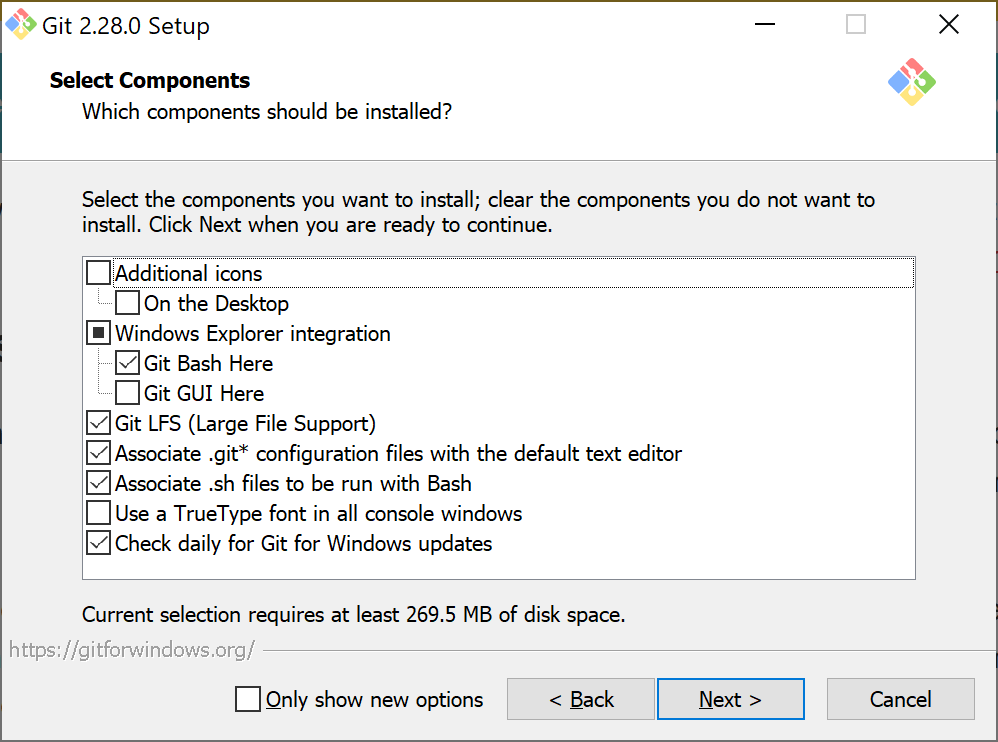
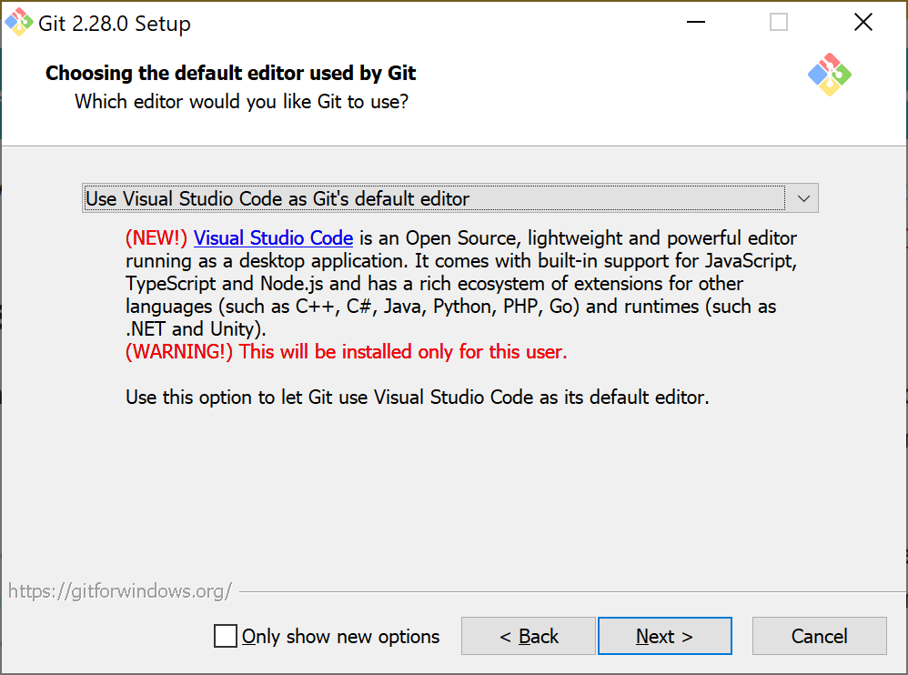
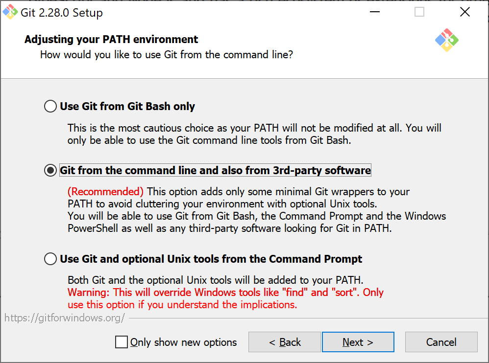
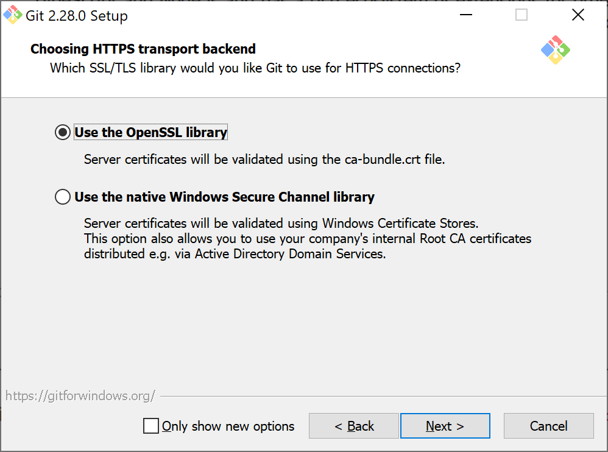
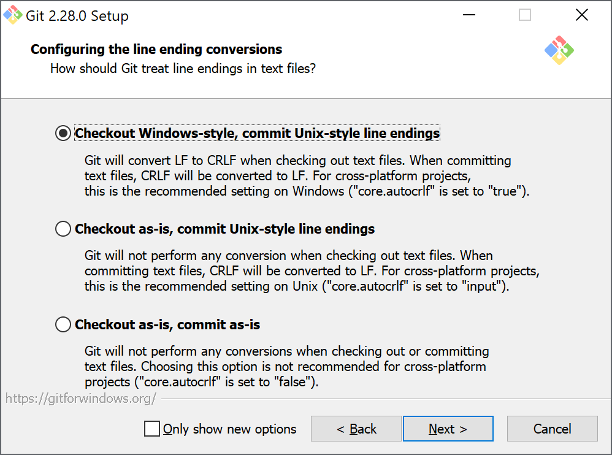
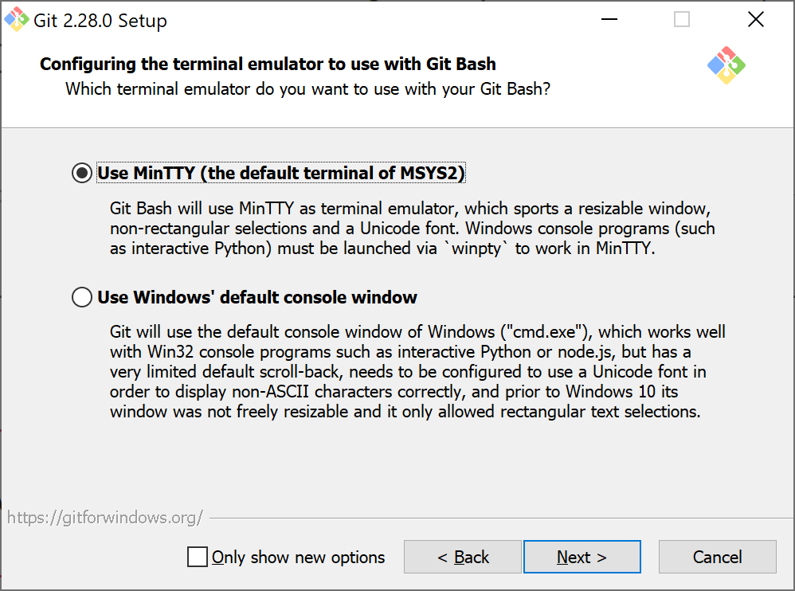
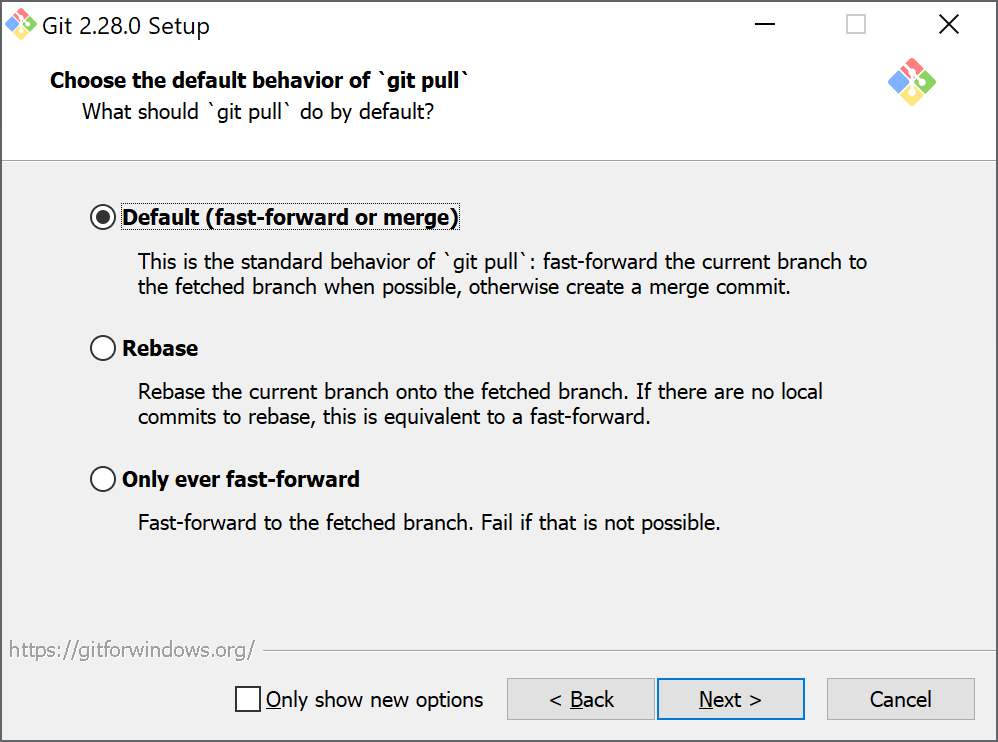
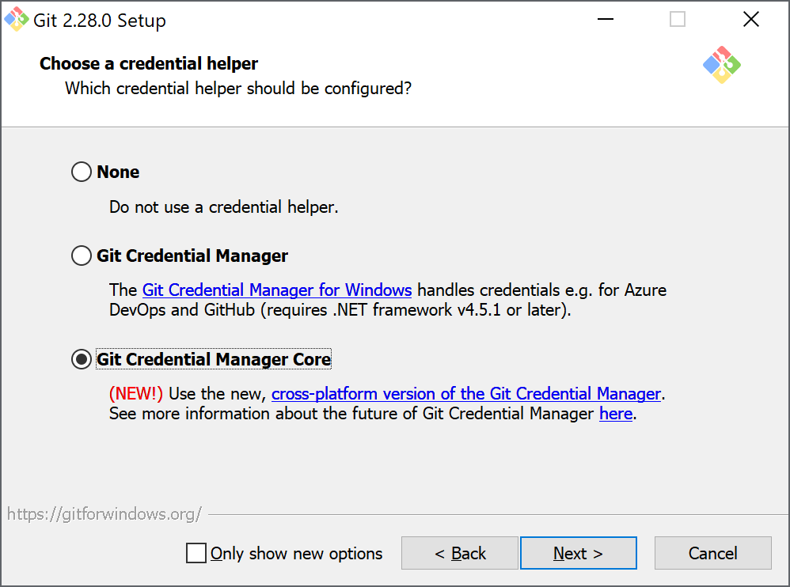
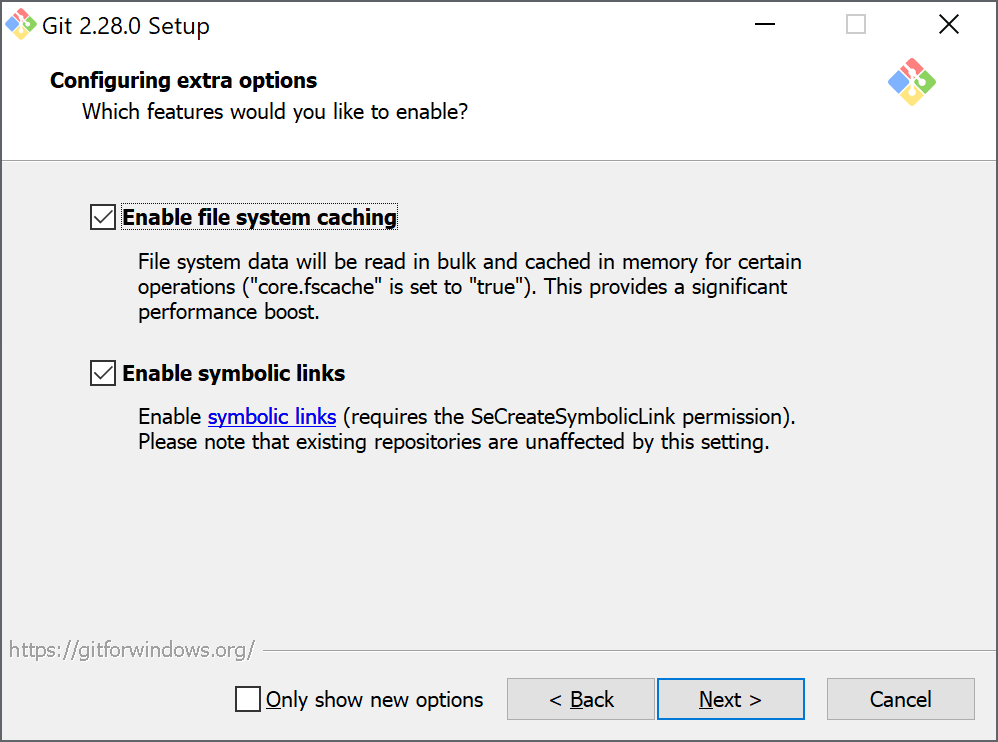

Descarga el instalador de la versión más actual desde la [página de descargas](https://git-scm.com/downloads), asegurate de seleccionar el instalador indicado para tu sistema operativo, por ejemplo [Windows](https://git-scm.com/download/win).

{}
Si estás en un sistema operativo diferente de Windows, sigue las instrucciones dependiendo si estas en [Linux/Unix](https://git-scm.com/download/linux) o [Mac OS X](https://git-scm.com/download/mac) de la página oficial.
{}

Para la instalación en Windows, ejecuta el instalador y selecciona las opciones como en la siguiente imagen.

En la siguiente ventana selecciona `Use Visual Studio Code as Git's default editor`, para poder utilizar _Visual Studio Code_ como el editor por defecto de mensages de commit.

En la siguiente ventana selecciona `Git from the command line and also from 3rd-party software`, para poder utilizar el comando `git` tanto en la terminal por defecto `git-bash` como en otras terminales del sistema operativo (`cmd`, `powershell`, `terminal`).

En la siguiente ventana selecciona `Use the OpenSSL library`, para utilizar la libreria interna `OpenSSL` para la seguridad en la comunicación con servidores remotos.

En la siguiente ventana selecciona `Checkout Windows-style, commit Unix-style line endings` para que _Git_ se encargue de cambiar los finales de linea de los archivos de texto entre modo Windows y modo Unix, esto permite la compatibilidad del repositorio con otra plataformas (Linux, OSX).

En la siguiente ventana selecciona `Use MinTTY (the default terminal of MSYS2)` para que cuando sea requerido _Git_ utilice la terminal integrada `Git Bash` por defecto.

En la siguiente ventana selecciona `Default (fast-forward or merge)` para que _Git_ utilice esa técnica a la hora de hacer `pull` de un repositorio remoto.

En la siguiente ventana selecciona `Git Credential Manager Core` para que _Git_ utilice su sistema interno de manejo de credenciales.

En al siguiente ventana habilita las dos opciones disponibles; una para que se haga un cache interno de la aplicación y otra para que se habilite la creación de enlaces simbólicos (virtuales).

En la siguiente ventana habilita `Enable experimental support for pseudo consoles` para poder usar interpretes de comandos dentro de _Git Bash_.

Estas son toda las opciones de importancia, continua y termina la instalación.
