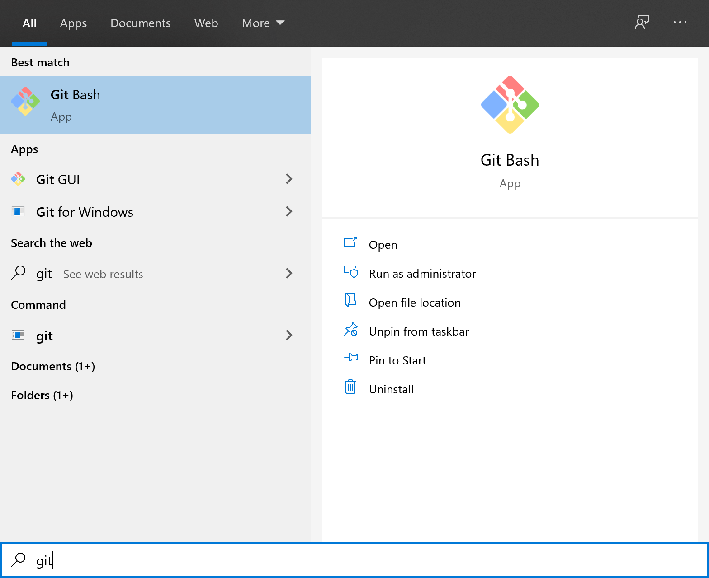

Antes de continuar con las instrucciones para instalar las herramientas/librerías siguientes, te recomiendo utilizar la consola que viene por defecto en _Git_ llamada _Git Bash_, presiona la tecla windows y escribe `git`. Seguramente será una de las opciones que salga como en la siguiente imagen.



Una vez abierta la consola, confirma que tienes Python instalado ejecutando el comando `python`, esto abrirá el interprete de comandos de Python y aparecerá algo como.

```txt
Python 3.9.0 (tags/v3.9.0:9cf6752, Oct  5 2020, 15:34:40) [MSC v.1927 64 bit (AMD64)] on win32
Type "help", "copyright", "credits" or "license" for more information.
>>>
```

Para salir del interprete solo ejecuta el comando `exit()`.

## PIP

`pip` es el [instalador de paquetes](https://packaging.python.org/guides/tool-recommendations/) para Python. Tu puedes utilizar `pip` para instalar paquetes desde el [Indice de Paquetes de Python](https://pypi.org/) y otros indices.

Esta herramienta viene instalada por defecto en versiones de Python mayores a **3.4**, si estas usando un [Ambiente Virtual](https://packaging.python.org/tutorials/installing-packages/#creating-and-using-virtual-environments) creado con [virtualenv](https://packaging.python.org/key_projects/#virtualenv) o [pyenv](https://packaging.python.org/key_projects/#venv), solo asegurate de actualizar [`pip`](https://pip.pypa.io/en/stable/installing/#upgrading-pip) con el siguiente comando.




```sh
python -m pip install -U pip
```




```sh
pip install -U pip
```




## Pipx

`pipx` es una herramienta que ayuda a instalar y ejecutar aplicaciones en usuario final escritas en Python. Es similar a `brew` en _macOS_, `npx` de _Javascript_, y `apt` de _Linux_.

Está fuertemente relacionado con `pip`. De hecho, utiliza `pip` internamente, pero está enfocada a instalar y administrar paquetes de Python que puede ser ejecutados desde la linea de comandos directamente como aplicaciones.

Para installar ejecuta los siguientes comandos.




```sh
python -m pip install --user pipx
python -m pipx ensurepath
```




```sh
brew install pipx
pipx ensurepath
```




## Virtualenv

`virtualenv` es una herramienta de linea de comandos que necesita el interprete de comandos de Python para ser ejecutado. Utiliza la variable de entorno `PATH` de tu máquina crear ambientes virtuales aislado de Python, muy similar a lo que hace `venv`. `virtualenv` provee funcionalidad adicional, comparado con `venv`, al soportar Python 2.7 y además de proveer funcionalidades para configurar, mantener, duplicar, y solucionar errores de ambientes virtuales. Para más información ve a la sección [Creating Virtual Environments](https://packaging.python.org/tutorials/installing-packages/#creating-and-using-virtual-environments) de la guía oficial.

Sí ya tienes un interprete funcional de `Python3.5+` es mejor utilizar `pipx` para instalar `virtualenv` en un ambiente aislado. Esto tiene el beneficio añadido de que podrás actualizar `virtualenv` sin afectar otras partes del sistema.

```sh
pipx install virtualenv
```

Una vez instalado puedes ver la ayuda con `virtualenv --help`.
