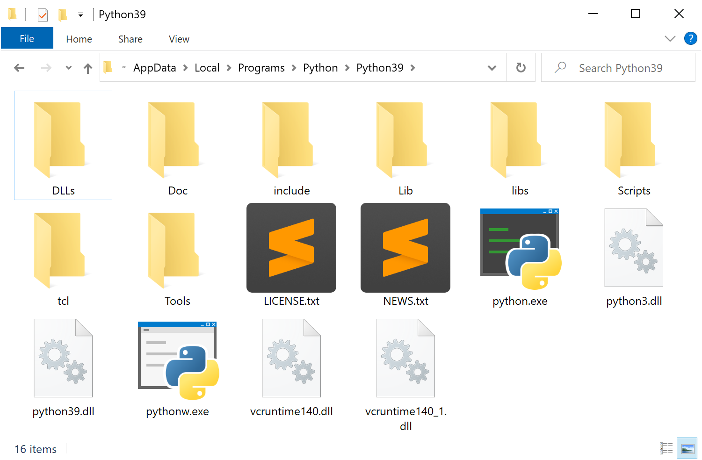
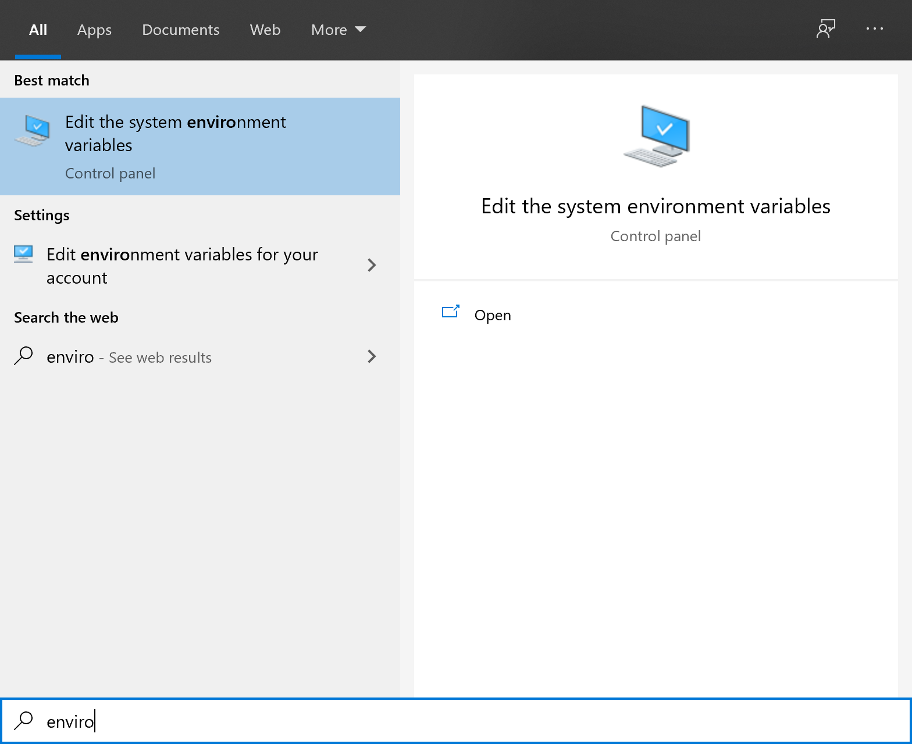
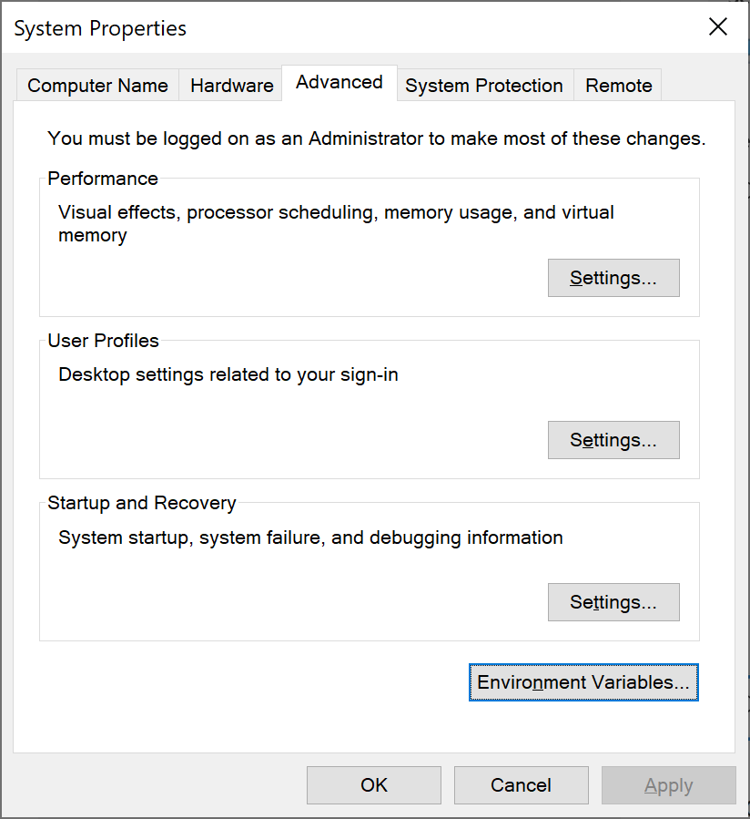
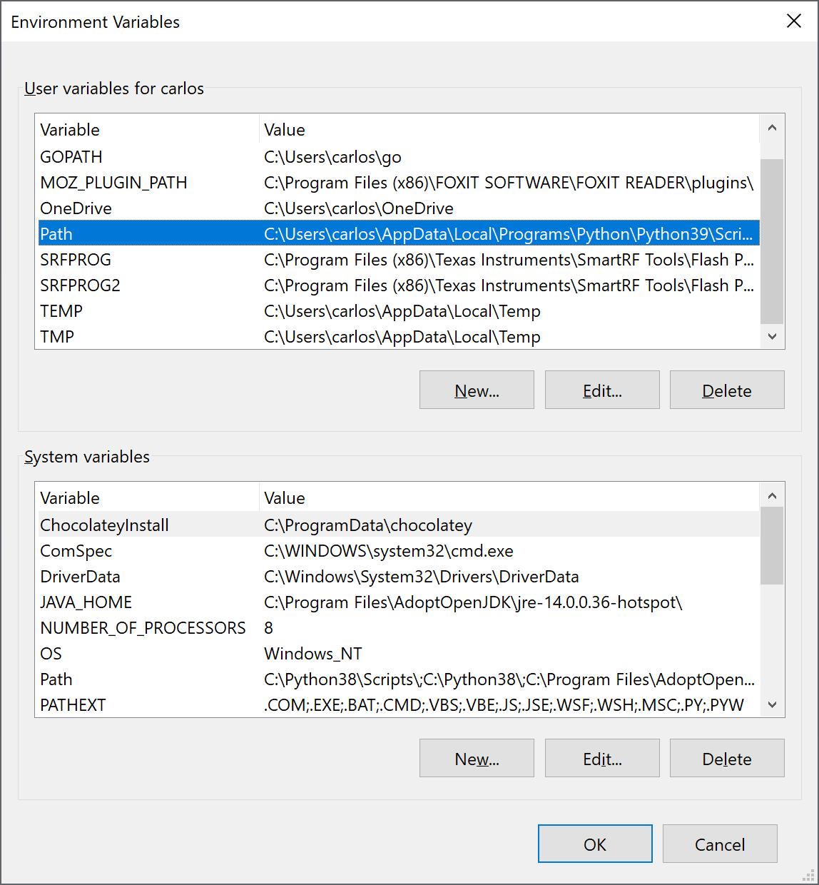
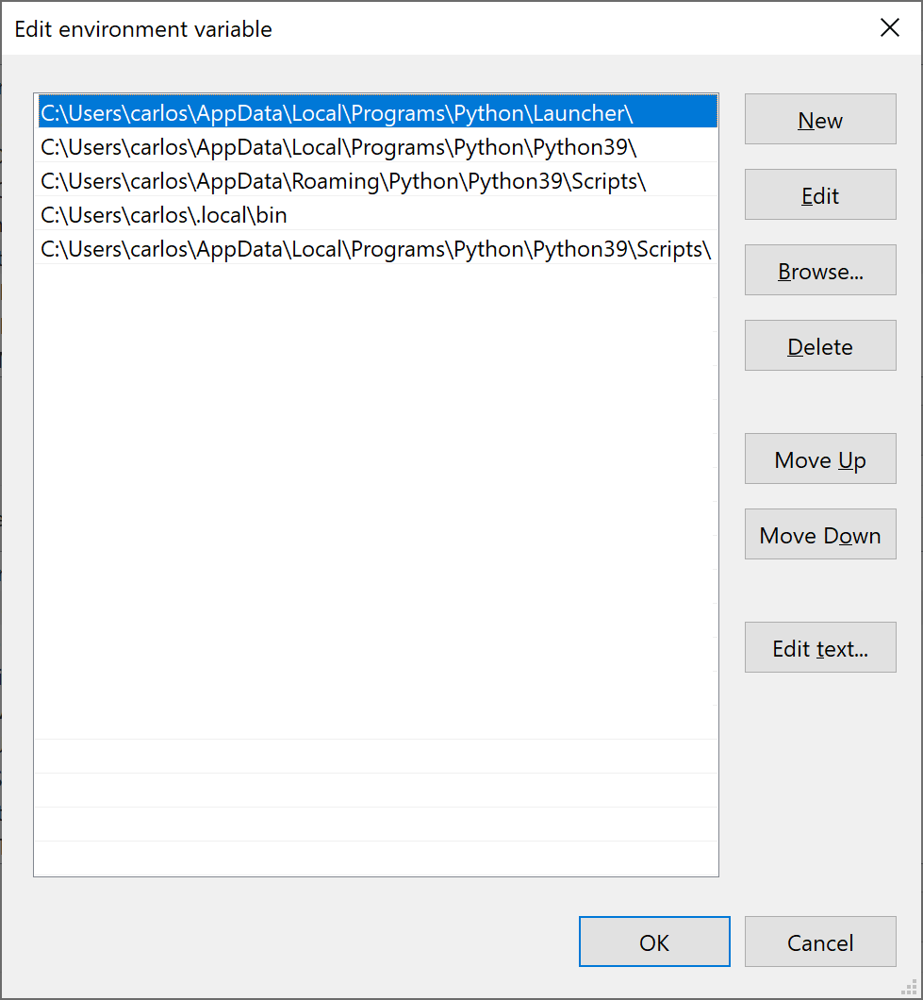

Puedes descargar un instalador de la [sección de descargas](https://www.python.org/downloads/) de la página oficial, asegurate de seleccionar la indicada para tu sistema operativo.

{}
**Tip**
\
Si utilizas Windows asegurate de seleccionar _Windows x86-64 executable installer_ si tienes una máquina de **64-bits** o _Windows x86 executable installer_ si tienes una máquina de **32-bits**.
{}

Una vez descargado y cuando lo ejecutes deberás ver una ventana como la siguiente.

Asegurate de seleccionar `Add Python 3.9 to PATH`, y da clic en `Install Now`. La instalación continuará, y al final puedes cerrar la ventana.

El siguiente pasó es agregar todos las rutas necesarias a nuestra variable de ambiente PATH. En una ventana del explorador de archivos ve al directorio de instalación de Python (por defecto `C:\Users\<tu_usuario>\AppData\Local\Programs\Python\Python39`).

Ahora es momento de abrir la ventana donde podemos modificar nuestras variables de entorno, para esto clic en la tecla windows y busca Environment Variables deberia de salir esta opción.

Al entrar puedes ver que se abre una ventana con el titulo _System Properties_, aquí haz clic en el botón `Environment Variables...` y se abrirá por fin la ventana de nuestro interés.

En esta ventana de _Environment Variables_ dentro de la caja de texto indicada como `User variables for <tu_usuario>` buscan la _Variable_ `PATH`, seleccionala, y da clic en `Edit...`.

En esta nueva ventana verifica que tengas las 5 rutas que se muestran en la imagen anterior, en caso contrario añadelas, modificando el usuario por el tuyo.

Aquí una lista de las rutas:

-   `C:\Users\tu_usuario\AppData\Local\Programs\Python\Launcher\`
-   `C:\Users\tu_usuario\AppData\Local\Programs\Python\Python39\`
-   `C:\Users\tu_usuario\AppData\Roaming\Python\Python39\Scripts\`
-   `C:\Users\tu_usuario\.local\bin`
-   `C:\Users\tu_usuario\AppData\Local\Programs\Python\Python39\Scripts\`

{}
**Tip**
\
Te puedes ayudar de la barra de direcciones del explorador de archivos para navegar en los folders, y despues copiar las rutas correspondientes para al final agregarlas a tu variable `PATH`.
{}
