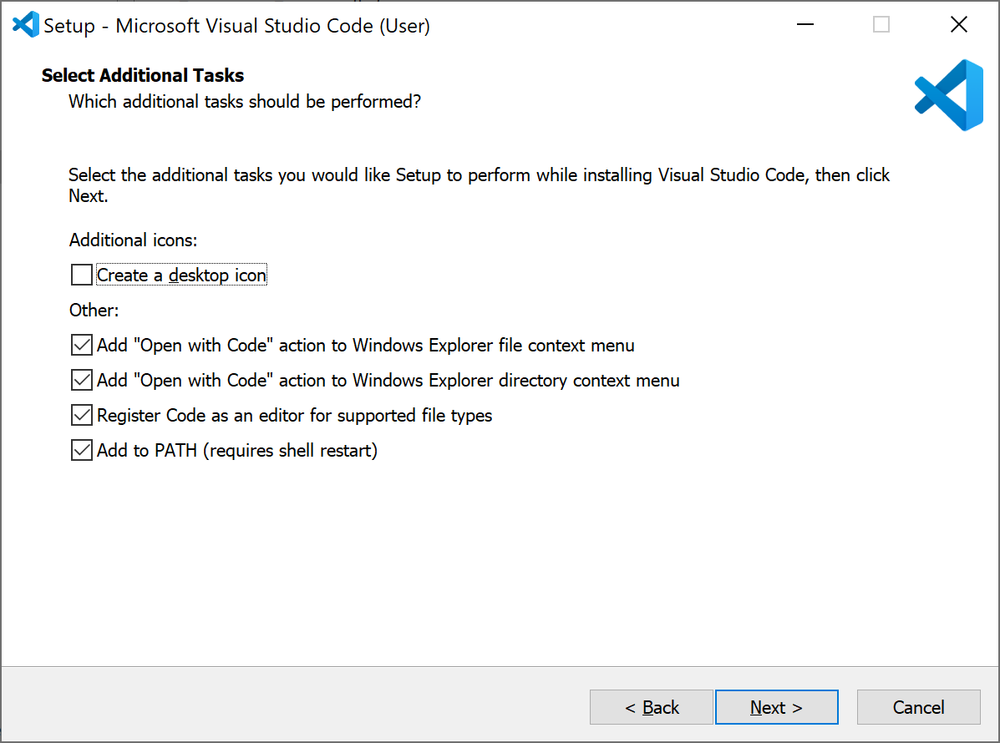
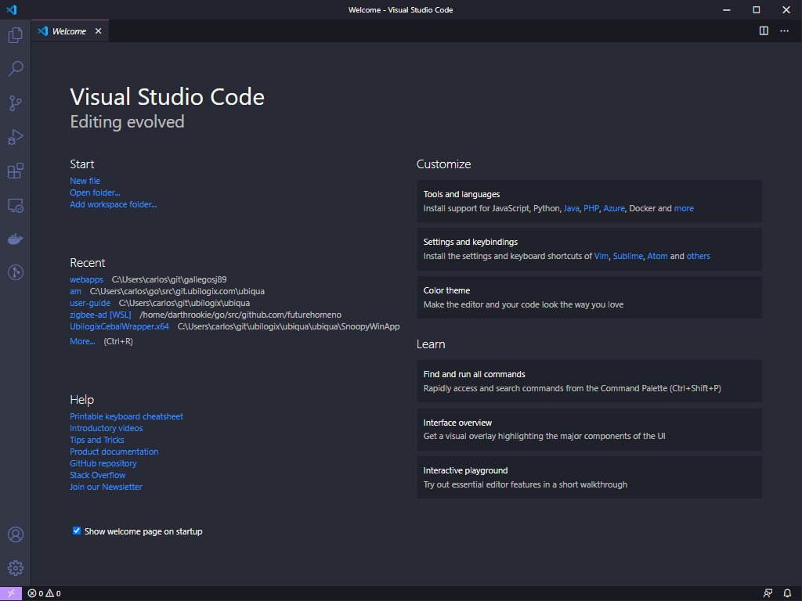
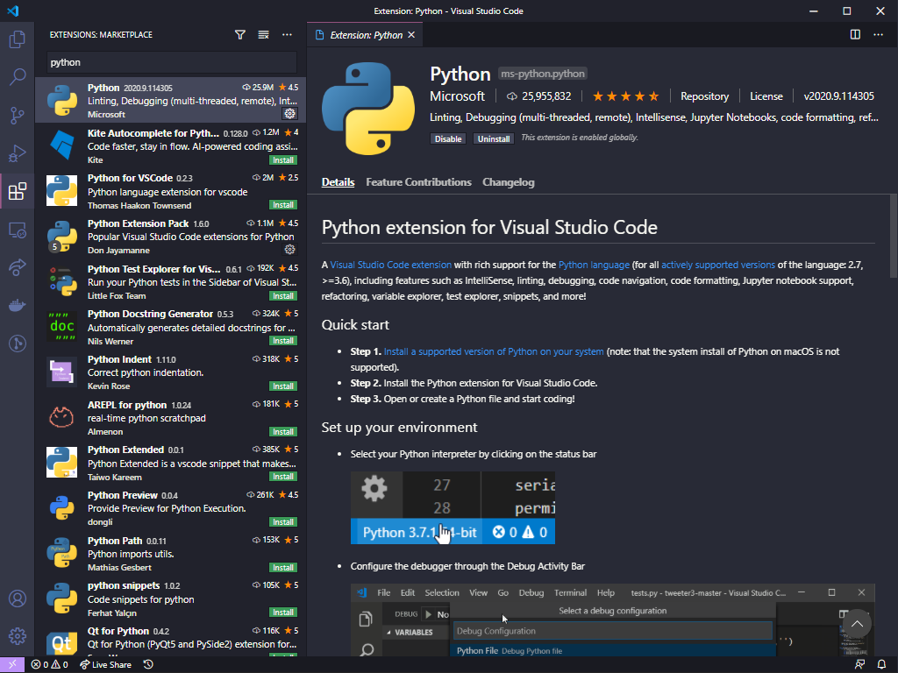

Primero que nada descargaremos el release oficial más nuevo desde la [página de descargas](https://code.visualstudio.com/). Lo ejecutamos, aceptamos el contrato de licencia, y en la siguiente ventana seleccionamos las opciones como en la imagen de abajo.

Posteriormente continuamos y finalizamos la instalación.

### Extensión para Python

Abrimos _Visual Studio Code_ y deberiamos de ver una pantalla como la siguiente imagen.

En la esquina inferior izquierda se encuentra un engrane, al darle clic selecciona la opción extensions. En la barra de busqueda que aparecerá buscar por _Python_, generalmente la primera opción es la extensión de nuestro interés (la que es publicada por Microsoft). Guiate con la siguiente imagen.

